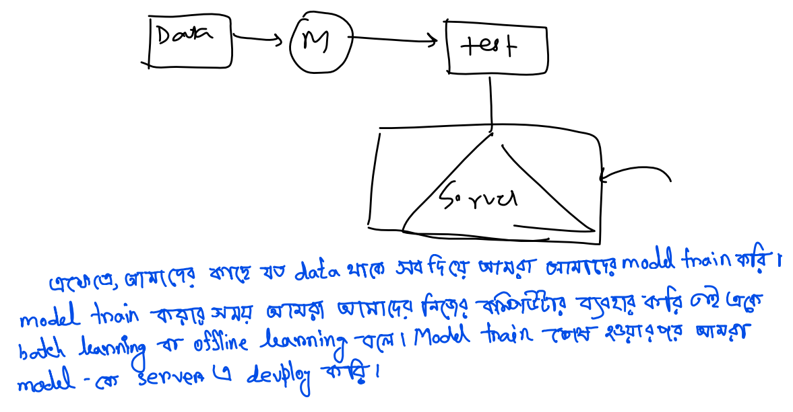
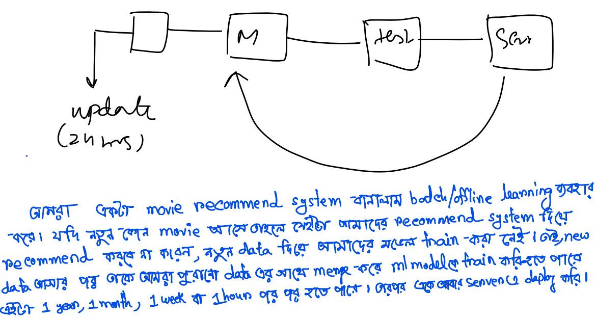

---
---
---
 

# Types of ml base on how to train in production:

 
---
---
---

- `Production: The server in which our code in going to run know as production phase. A user will hit api of my model and use it.`

- `Development: When we code in our computer know as development phase.`

# আমাদের ml মডেল server এ আলাদা আলাদা functionality নিয়ে চলে । তার উপর ভিত্তি করে ml দুই ধরনের হয় 

- `Batch learning / offline learning `

- `Online learning `

---
---
---
 

# Offline or Batch Learning:

 
---
---
---

 

# Problem with Batch Learning:

# Disadvantage of Batch Learning/online Learning:

- `Lots of Data: যেহেতু আমাদের কাছে যত Data আছে সবটুকু একবারেই train করতে হবে । যদি আমাদের কাছে অনেক অনেক বেশি Data থাকে তাহলে আমরা আমাদের মডেলকে আর করতে পারবো না ।  `

- `Hardware Limitation: `
- `Availability: `

