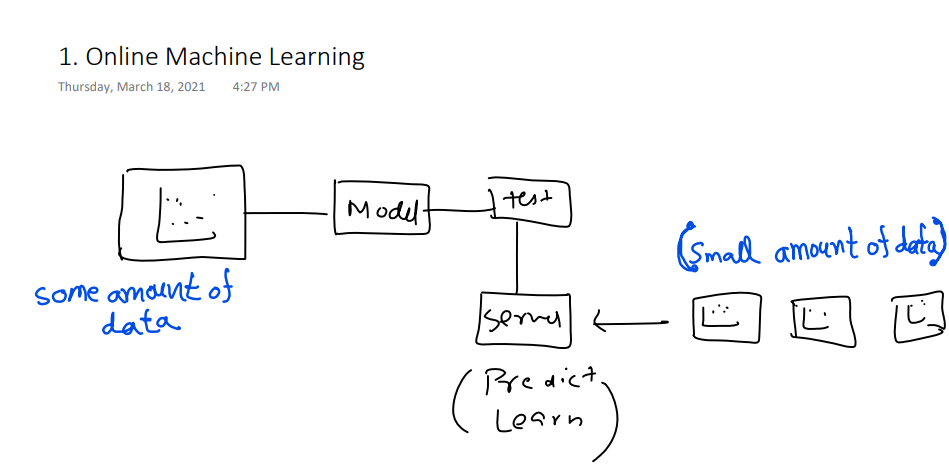

---
---

 

# Online Learning:

 

---
---

### `কোন কোন  company বলে আমরা যত তাদের  product ব্যবহার করবো তত তাদের product performance increase করবে । এইটা বলতে আমরা বুঝবো তারা Online Learning ব্যবহার করতেছে ।`

`Online Machine Learning এ আমরা শুরুতে কিছু পরিমাণ ডাটা দিয়ে আমাদের model train করি । তারপর আমরা সেই model কে server এ deploy করি । Server এ অল্প পরিমাণ কিছূ ডাটা আসতে থাকে এবং সেই ডাটা দিয়ে model prediction এবং learn করে । Example: chatbots, google now, alexa, siri, youtube . `

# When to use online learning:

- `When there is a concept drift: #concept drift# When problem nature changes overtime then we use online learning । যেমনঃ Stock Exchange এ ভ্যালু frequently change হয় । `

- `Cost Effective: `

- `Faster Solution: `

