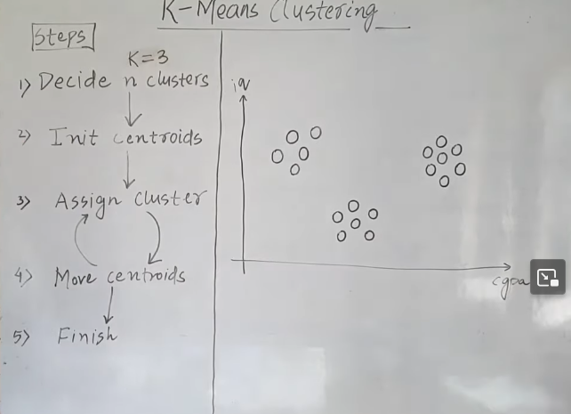
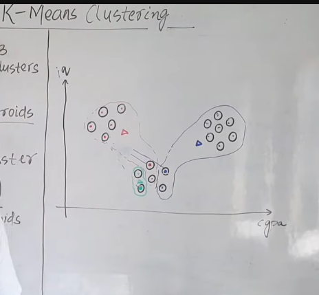
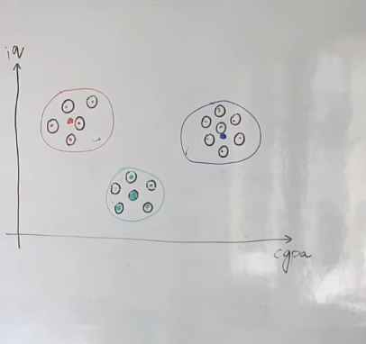
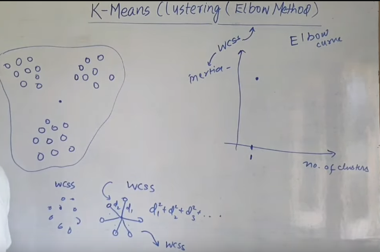
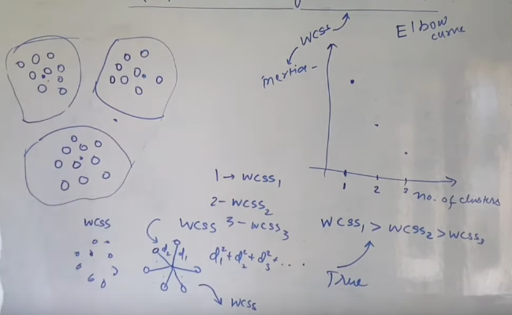
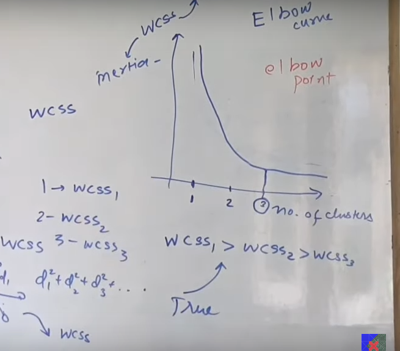

 
 

# `# K-Means Clustering: Geometric Intution:(Lecture:103)`

 
 

**Problem Statement:** আমাদের একটা university cse student গুলোর cgpa and iq এর value দেওয়া আছে । এখন, আমরা students গুলোকে এমন ভাবে group করবো যেন আমাদের palcement record ভালো হয় । 

`**setp:01**` মজার বিষয় হচ্ছে যে, আমাদের কতগুলো cluster হবে তা আমাদের নিজেদেরই decide করতে হবে । এখন, ছবিতে আমাদের 2D data আছে, কিন্তু যখন ডাটা আরো higher dimentional এ থাকবে তখন data বা  scatter plot দেখে আমরা বের করতে পারবো না কতগুলো  cluster হতে পারে। আপাতত, ধরি আমাদের ছবির ক্ষেত্রে cluster 3টা হবে । আমরা পরে দেখবো কীভাবে কত গুলো cluster হবে সেইটার value ঠিক করা । 
**K-Means Clustering, এখানে, k মানে হচ্ছে আমাদের কত গুলো cluster হবে তার সংখ্যা ।**

`**step:02 and step: 03**` 
  

কয়টা cluster হবে সেইটা ঠিক করার পর আমরা randomly (k=3) তিনটা point কে cluster centroids হিসেবে ধরে নিয়েছি । এরপর, সেই তিনটা centroid থেকে যেই পয়েন্ট গুলো কাছে তাদেরকে সেই centorids under এ রেখে 3টা cluster বানিয়েছি । 

`**Step:04**` 

step 4 এ আমাদের যে, ৩টা cluster তৈরি হয়েছে সেগুলোর নতুন করে আবার centroid নির্ধারণ করতে হবে । উপরের example এ যেহেতু আমরা cpga and iq নিয়ে কাজ করতেছি তো সব গুলো cluster এর ক্ষেত্রে cluster টি যতটুকু অংশ জুড়ে আছে ততটুকুর জায়গা থেকে  mean calculation করে নতুন করে আবার, centroid assign করতে হবে । 

 

সেমভাবে, আমরা setp:03 থেকে step:04 repeat করবো । যতক্ষন না পযন্ত, centroid এর movement stable হচ্ছে । মানে যদি আমাদের centriod সেম জায়গায় থাকে তাহলে আমরা বুঝবো যে, আমাদের cluster তৈরি হয়ে গেছে । 

 

`এই প্রসেস চলার  সময়, প্রথমে একটা datapoint **(cluseter গুলোকে red,greed,blue হিসেবে বিবেচনা করলে)** red, cluster এর under এ থাকলে সেইটা red হলো  । কিন্তু,  যদি পরবর্তীতে, centriod move করার পর সেই সেম datapoint blue এর কাছে থাকে তাহলে আমরা পরবর্তীতে সেইটাকে blue cluster এর under এ ফেলবো  ।`

**মজার ব্যাপার হচ্ছে, এই algorithrm টা শুধু euclidean distance দিয়ে implement করেছি । আর এইটা 2D, 3D এর থেকে বেশি dimentional এ space এর ক্ষেত্রে প্রযোজ্য  ।**

 

# `# How to Decide n Cluster: (Elbow Method)`

 

Elbow Method এ আমরা একটা graph বানাই, যেখানে, Y-axis এ WCSS and X-axis এ no. of Cluster থাকে । যেখানে, WCSS **(Within Cluster Sum of Squared Distance)** । WCSS বের করার জন্য centriod থেকে সেই cluster এর সকল point গুলোর distance(d1,d2,d3..dn) sqaure করে যোগ করবো । একেই বলতেছি সেই cluster এর wcss ।  

যদি আমাদের কাছে, দুইটা cluster থাকে তাহলে, 1st cluster এর  WCSS1 হলে 2nd cluster এর wcss2 হলে, যখন সেইটাকে graph এ আকবো তখন, number of cluster হবে দুই আর overall WCSS হবে **(WCSS1+WCSS2)** । Logically, আমাদের যত Number of cluster বাড়বে তত আমাদের WCSS এর sum কমবে  ।

এখন, আমরাদের যদি 50 টা point থাকে আমরা যদি number of cluster 50 টা ধরি তাহলে, WCSS = 0 হবে কারণ, তখন, সবগুলোয় centriod, এর centroid এর আশে পাশে কোন data point থাকবে না । তাই,  square sum zero হবে ।  এখন, কীভাবে বুঝবো যে,   `আমার number of cluster কত গুলো হবে?` 

যেখানে, আমাদের graph একটু stable হবে সেইটায় হবে number of cluster । 

আর, number of cluster 1 থেকে যখন number of cluster 2 গেলাম তখন এদের wcss এর value অনেক কমে গেল উপরের ছবি থেকে । আর numebr of cluster 3 থেকে যখন number of cluster 4 হবে তখন, wcss এর ভ্যালু গুলোর মধ্যে তেমন difference বুঝা যাবে না । তখন, আমরা বুঝতে পারবো আমরা approatre track এ আছি । 

 
 

# `# K-Means Clustering: Coding :(Lecture:104)`

 
 

- with sklearn

 
 

# `# K-Means Clustering: Coding :(Lecture:105)`

 
 

- Coding from Scartch.

