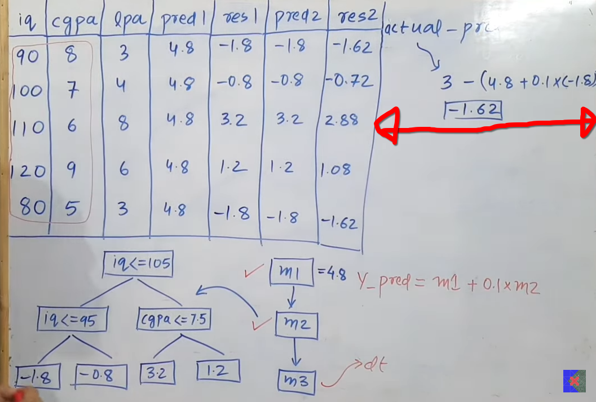

 
 

# `#Gradient Boosting: (Lecture: 106)`

 
 

**Introduction:** Gradient Boosting is also a boosting algorithm. Previously, we learn `Adaboost` Algorithrm. আমরা adaboost পড়ার সময় দেখেছি যে, boosting algorithrm এ আমরা ছোট ছোট মডেলকে একত্রে করে একটা বড় মডেল বানায় । যেইটাকে আমরা, Sequential satage wise addition । মডেল গুলোতে ডাটা আমরা sequentially add করি । প্রথম, model এর কাজ শেষ হওয়ার  পর মডেল কি কি ভুল করেছে, সেইটা 2nd model কে বলি by using upsampling । এখানেও সেম কাজ করবো । 

আমরা উপরের toy dataset নিয়ে কাজ শুরু করবো । আর ধরি আমাদের  number of base estimator হবে ৩ টা । আর, এই toy dataset দিয়ে, আমরা regression problem solve  করবো । এখন, Gradient Boosting এর ক্ষেত্রে, আমাদের যে প্রথম model থাকে ঐটা just আমাদের regression এর actual output যেইটা থাকে, তার mean হবে 1st model এর output । উপরের ছবিতে, (3+4+8+6+3)= 4.8 হবে । 

এরপর, আমাদের 1st model কি পরিমান ভুল করতেছে সেইটা বের করতে হবে । এর জন্য আমাদের একটা loss function লাগবে । এখন, এই loss function কে আমরা pseudo-residual বলতেছি । **loss_fuction = actual - predictied** । 

 

 

1st model এর output এর error কে res1 হিসেবে denote করে output লিখলাম । এখন, আমাদের 2nd model হিসেবে আমরা decision tree ব্যবহার করবো  ।আমরা অন্য ml algorithrm ব্যবহার করতে পারি, কিন্তু, decision tree সবচেয়ে ভালো result দেয়। 

 

**Imoprtant বিষয় হচ্ছে, আমরা এখন, এই decision tree কে কীভাবে train করবো ??**  আমরা decision tree এর  input হিসেবে, iq, cgpa দিব । আর, output column হিসেবে salary না দিয়ে, res1 দিব ।  অর্থাৎ, model2 বা decision tree, আমাদের model1 কি পরিমান ভুল করতেছে সেইটা পরিমান করতেছে। 

আমাদের decision tree যত ভালো error capture করতে পারবে, বা ভুল যত ভালো ধরতে পারবে, আমরা তত accurate result পাবো । আমরা, উপরের ছবির মতো একটা tree পায় ,যদি উপরের ডাটা দিয়ে আমরা, একটা decision tree train করি  । 

আমাদের কাছে  যদি, এই দুইটা model ওই থাকলে তাহলে আমরা prediction কীভাবে করবো?? prediction হলোঃ **(model1_output + model2_output)** । কিন্তু, এই formula এর একটা  prb হচ্ছে যে, আমার আউটপুট সেম আসতেছে হুবহুব,অর্থাৎ মডেল overfitting করতেছে । তাই, আমরা একটা learning rate যুক্ত করে দেই, তাহলে formula টি হবে ,  
**prediction** = **(model1_output + lr * model2_output)**
 
এখন,   lr = 0.1 হলে,  1st row এর ক্ষেত্রে,   
4.8 - 0.18 = 4.7  
এখন,আমাদের output সঠিক আসে নাই । কিন্তু, এই ধরনের অনেক গুলো model ব্যবহার করে আমরা ultimetly সঠিক ans এর দিকে যায়। 

 

এখন, আমরা model2 এর prediction এর থেকে residual error, res2 বের করবো । এরপর, আমরা, model3 এর জন্য,iq,cgpa and res2 পাঠিয়ে দিব । 

এরপর আমরা, model3 থেকে যে y_pred পাবো, সেইটা থেকে res3 বা prediction হবে, ( m1 + 0.1*m2 + 0.1*m3) । যেখানে প্রথম row এর জন্য, 
(4.8 - 0.18 - 0.126) = 4.5 । 

**লক্ষনীয় বিষয় যে, learning rate সকলের সমান হবে ।**

 

### **Code Example:**
- decision trees depth should be under (8 to 32) to get the best result.

 

### `Adaboost vs Gradient Boosting:`

- **Max leaf Node:** Adaboost: 1, Gradient Boosting: 8 to 32
- We assign weight in Adaboost but we add learning rate in Gradient Boosting. 

