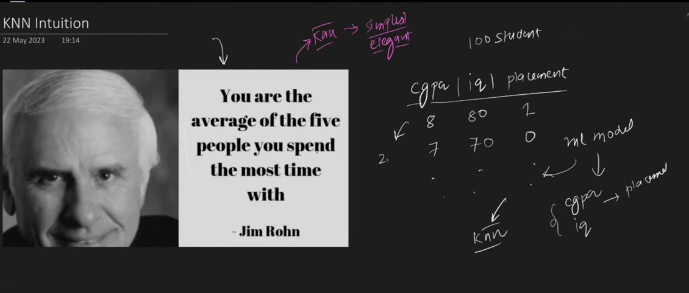
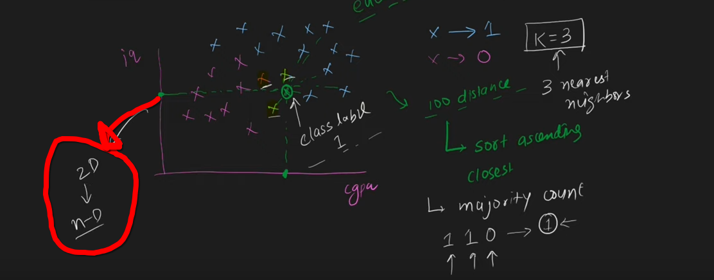
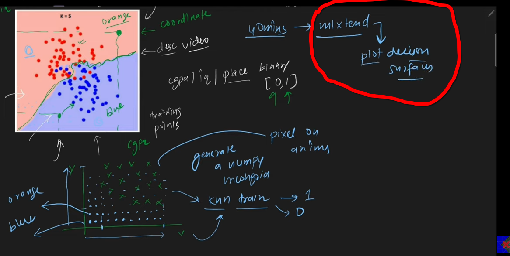
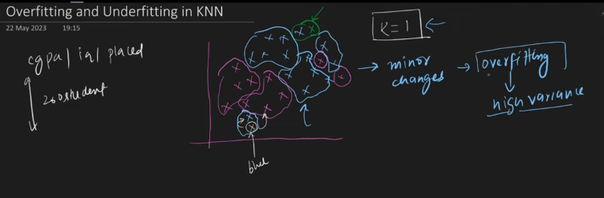
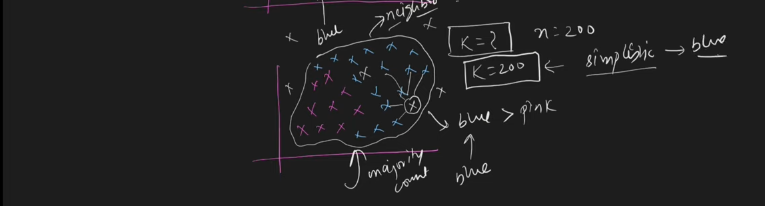

 
 

# `# Introduction to KNN: (Lecture: 111 )`

 
 

**Motivated from a quote:**  
`You are the average of the five people you spend the most time with.` - Jim Rohn.
 

K nearest neighbor মানে হচ্ছে যে আপনি আপনার neighbor এর মতো হন । আর, k হচ্ছে, number of neighbor । 

ধরি, আমাদের কাছে, ১০০ student এর cpga,iq and placement এর dataset আছে । এখন, আমরা এর উপর knn apply করবো, চলো । 

 

ধরি, mark করা datapoint টি হচ্ছে আমাদের query point । এখন, placement হবে নাকি হবে না সেইটা বের করার জন্য প্রথমে আমরা, query point থেকে বাকী data point গুলোর euclidean distance বের করবো । তারপর, সব গুলোকে sorting করবো ।  যদি আমরা, k = 3 ধরি, তাহলে, সবচেয়ে কাছে, যেই data point গুলো আছে সেই গুলোর distance বের করবো । এরপর majority count, 3 টার output যদি এমন হয় যে, [1,1,0] তাহলে, query point এর output হবে 1 । 

 

# `# Code Example:`

 

`KNN যেহেতু distance calculation এর মাধ্যমে কাজ করে তো আমাদের সব ভ্যালুকে same scale এ আনতে হবে । অর্থাৎ, আমাদের feature scaling করতে হবে ।`

 

# `# How to select K?`

 

**There are two appoarch to select the value of k.**

- **Heustric:** এখানে, যদি আমাদের column number n, হয় তাহলে, k=root(N) এইভাবে নেই । আর root(N) যদি এর মান জোড় হয় তাহলে সেইটা avoid করে বিজোড় নেওয়ার চেষ্টা করি । 

- **Expriemnt:** আমরা  এখানে, অনেক গুলো knn model train করি, যেখানে  k এর মান ১ থেকে শুরু করে নিজেদের ইচ্ছা মতো একটা হয় তারপর সেখান থেকে যার মানটা সবচেয়ে বেশি আসে সেইটাকে নিবো আমরা  ।

 
 

# `# Decision Surface or Boundry to measure the performance of Classification algo`

 
 

- It is applicable, svm, lr, dt, nn .

Decision surface বানানোর জন্য আমরা প্রথমে আমরা X and Y axis এ  আমাদের data point গুলো আকবো । এরপর, data point গুলো x-axis এ কতটুকু আর y-axis এ কতটুকু ছড়িয়ে আছে তার range বানাবো । তারপর, সেখানে আমরা meshgrid বানাবো numpy দিয়ে । তারপর, আমরা meshgrid এর সকল point গুলো দিয়ে knn train করে, output 1 হলে blue আর output 0 হলে orange দিয়ে encode করতেছি । **কিন্তু, মজার ব্যাপার হচ্চে, আমাদের এত কিছু না করে just mlxtend এর plot decision surface function দিয়েই সব করতে পারবো ।**

 
 

# `# Overfitting and Underfitting in KNN`

 
 

## **K এর মান কম হলে, say, 1 or 2**

k এর মান কম হলে, শুধু মাত্র সবচেয়ে কাছে যে neighbour থাকবে তাকে বিবেচনা করবে । outliers থাকলে সেইটাকে বিবেচনা করবে না । অর্থাৎ, অনেক overfitting হবে । 

এখন, k সবচেয়ে বেশি হবে row number এর সমান । let say k=200 । তাহলে, আমাদের dataset এ সবচেয়ে সেইটা বেশি থাকবে সেইটায় সবসময় জিতবে । উপরে আমাদের blue point বেশি তাই, majority count করলে blue always জিতবে । 

### `#With Code example in kaggle`

 
 

# `# Limitations of KNN`

 
 

**From where we will not use knn:**

- Large dataset `KNN এ সকল calculation prediction এর সময় হয় trainning এর সময় নয় । `

- In higher dimention euclidean distance  is not relaiable.

- With outliers knn will not give accurate results.

- Non homogenous scale `We should ensure that all the data point should be in same scale.`

- Imbalance dataset.

- Work in black box `আমার কোন result আসলে সেইটা কার জন্য আসতেছে বা কোন feature এর জন্য আসতেছে, সেইটা আমরা জানতে পারি না ।`

