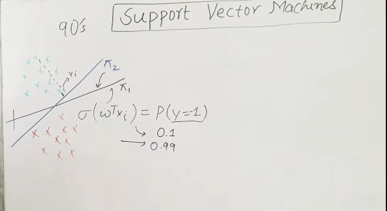
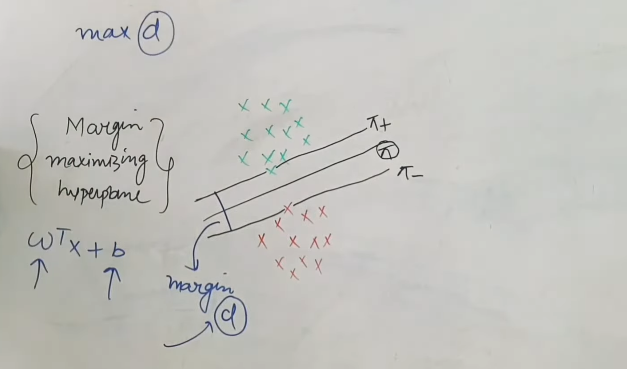
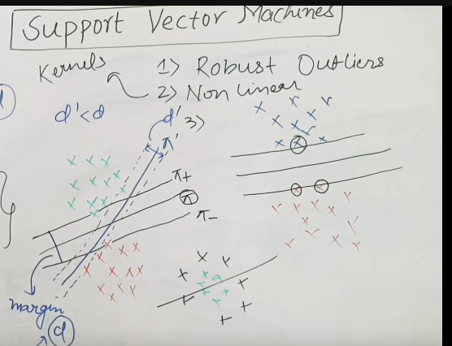

 

# `# Geometric Intution Of SVM:`

 

SVM, 90's এর দিয়ে এসেছে । এটা logistic regression এর improve version । আমরা জানি, logistic regression simple neural network এর মতো কাজ করে । WX+b,function কে sigmoid function এ দিয়ে probability পাই (০~১) এর মধ্যে পাবো । নিচের ছবির মতো আমরা decision boundary তৈরি করি । এখন, প্রশ্ন হচ্ছে, `$π_1$ নাকি $π_2$` কোনটা বেস্ট decision boundary?  $π_2$, কারণ logistic regression data point থেকে distance calculate করে । যেই point টা decision boundary এর কাছে হয় সেইটা sigmoid এ পাঠালে তার probability কম আসে, তাই, $π_1$ আমাদের best decision boundary নয় । আর best decision boundary খোজার কাজ করে SVM । 

**Margin Maximizing Hyperplane:** আমরা যে, data point থেকে distance calculate করতেছি । আর আমরা চাচ্ছি যে, এই distance সবচেয়ে maximum হবে । তাই আমরা একে Margin Maximizing Hyperplane বলতেছি ।  Margin maximizing Hyperplane,  unseen   data এর উপর ভালো performance করবে । But HOW?

আমরা প্রথমে decision boundary থেকে pi+ and pi- বের করবো । pi+ or pi- বের করার উপায় হলো যে পযন্ত প্রথম data point না পাচ্ছি । উভয় দিক থেকে । তারপর ,  margin(d) calculate করবো (distance between pi+ and pi-)। আমরা এই ধরনের multiple hyper plane এর জন্য distance calucalte করি ।  যার জন্য margin(d) এর বেশি হয় সেইটা কে আমরা finally select করি ।

**Let's add another hyperplane:** নিচে আমরা আরেকটা hyperplane এর জন্য pi+ and pi- বের করে, margin(d`) বের করেছি । তারপর best hyperplane choose করেছি । 

**i) SVM Robust to outliers.**
**ii) We can handle non-linaer data with Kernels.**

**Why the name Support Vector come from?** আমরা যখন pi+ and pi- বের করলাম তখন, আমাদের সবচেয়ে কাছের data point বা vector গুলোর সাহায্য নিয়েছি । এই  vector গুলোকে আমরা support vector বলতেছি । উপরের চিত্রে, mark করা vector গুলো হলো support vector । 

