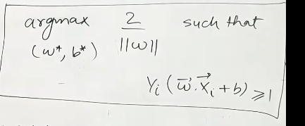

 

# `# Mathematics behind SVM:`

 

আমরা, একটা vector W ধরে নিব । যেইটা আমাদের decision bounary এর উপর লম্ব অবস্থায় থাকবে । যদি আমাদের একটা point U(x,y) হয় আর reference point থেকে distance C হয় তাহলে,  W.U >= C । 

আমরা hyperplane এর equation কে একটা line এর equation ধরে নেই তাহলে, একটা point এর জন্য desmos এ খুব সহজেই visulization করতে পারবো । hyperpalne থেকে সেই point টা positive পাশে নাকি negative পাশে থাকবে । 

আমদেরকে w^TX+B=0, যেখানে, (W,B) এর মান বের করতে হবে । যেখানে,  যেকোন  input,Xi এর জন্য আউটপুট হবে , Y_bar । আমরা, margin(d) এর মান maximize করতে হবে । এখন, প্রবলেম হচ্ছে, আমাদের এই d এর জন্যও equation find করা লাগবে । let's take  WX+B = 1, for pi+ and WX+B = -1 from pi- এখন, আমরা যে, 1 = 1 দুইটা সেম ভ্যালু নিলাম এর কারণ কি? কারণ, হচ্ছে, hyperplane এর  equal distance এ আমাদের (d1)pi+ and (d2) pi- থাকবে । আর, আমরা 1  এর পরির্বতে, 23,24,25 যেই ভ্যালু নেই না কেন সেইটা আমাদের কোন  impact পড়ে না । তাই, আমরা same value নেই । 

এখন প্রশ্ন হচ্ছে, WX+B=1---(i) and WX+1=-1----(ii) এই দুইটা equation এমন কেন? আমরা desmos এ গিয়ে visulization করতে পারবো, WX+B=0 ,hyperplain এর একটা equation ধরে নিয়ে,  equation 1, 2 কে 10,20  দিয়ে গুণ করে দেখবো । আবার, 0.something দিয়ে গুন করে দেখবো । for better visuliztion zoom in the line.

এখন, wx+b=1 এইটা pi+ হতে হবে । আর, wx+b=-1 এইটা pi- এ হতে হবে । wx+b=1 যদি দুইটা দুই পাশেই চলে যায় সেক্ষেত্রে distance maximum হবে, কিন্তু আমাদের constrain, wx+b=1 এইটা pi+, hyperpalne এর উপরেই হতে হবে । এর জন্য আমরা constrain set করবো, w.x + b >= 1, w.x+b<= -1 । আমরা, দুইটা constrain maintain না করে, একটা করতে পারি, $Y_i$ গুন দিয়ে । $Y_i$ = 1 হলে, 1st and $Y_i$ = -1 দিলে 2nd equation টা পাবো । আর, support vector এর জন্য $Y_i$ (W.X+B) = 1  এইটা হবে final equation । 

আমরা W vector কে hyperplane এর উপর perpendicular ধরে নিয়েছিলাম । এখন, d এর ভ্যালু calculation করার জন্য, দুইটা support vector, x1,x2, d নিচের  formula use করবো । 

Finally, we have to maximize the value of d within the given condition.

But, in this appoarach we have an assumption, আমাদের data কিন্তু, linearly separable হতে হবে । এই ধরনের প্রবলেম কে আমরা, Hard margin SVM বলি । যদি linearly sepparable না হয় তাহলে একে soft margin SVM বলে । 

