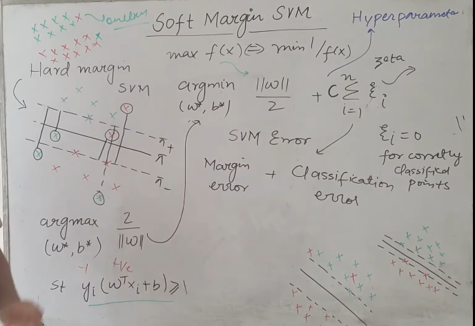

 

# `# Soft Margin SVM`

 

আমরা hard margin এর ক্ষেত্রে এই formula derive করেছিলাম । কিন্ত, আমাদের বাস্তব জীবনে ডাটা এত linear হয় না এতে outliers থাকে। এখন, আমরা , soft margin SVM এ, আমাদের কিছু পরিমানে outliers allow করবে । 

আমরা আমাদের আগের, hard margin SVM কে modify করবো । argmax এর পরির্বতে argmin ব্যবহার করবো, equation টা inverse করে । আর এর সাথে একটা নতুন term add করবো যেইটা আমরা zeta of i বলতেছি । 

tranning করার সময় আমরা data point গুলোকে pi+ and pi- এর respect এ দেখি । আর,  prediction এর সময় আমরা hyperplane(pi) এর respective এ data point গুলোকে দেখি । pi- এর উপর বা নিচে যেসব point আছে তাদের জন্য zeta(i)=0 হবে একইভাবে, pi+ এর উপরে বা লাইনের নিচে যেসব point থাকবে তাদের জন্যও zeta(i)=0 হবে । এখন চলো যেসব point pi+,pi- এর   উপরে থাকবে তাদের জন্য zeta(i) এর ভ্যালু কি হবে? pi+ এর মধ্যে যে সব ভ্যালু থাকার কথা সেগুলো যদি pi+ line cover এ থাকে তাহলে, pi+ line থেকে আবার একইভাবে  pi- থেকে বের করে sum করবো ।  

এখানে, finally আমাদের equation দাড়াচ্ছে, 

Margin_Error + C * Classification_Error

এখানে, C হচ্ছে  hyperparameter । আমরা, যদি c মান অনেক বেশি নেই তাহলে, আমরা আমাদের model কে বলতেছি reduce classification_error আমার margin যে maximize করতে হবে তার piority কম দাও । আর কমালে এর উল্টাটা । 

