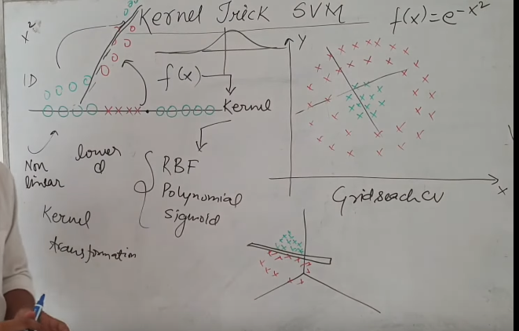
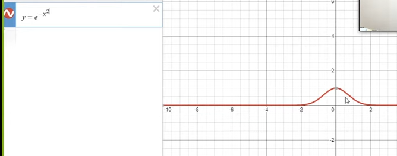
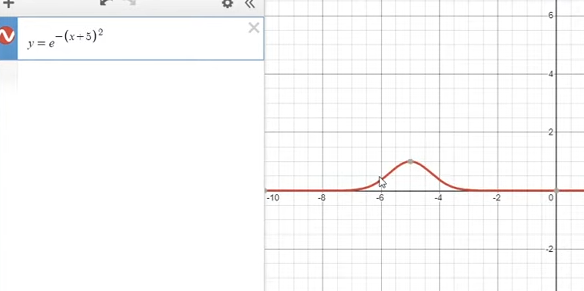

 

# `# Kernal Trick:`

 

যদি আমাদের data linearly seperable না হয় তাহলে আমরা একটা function ব্যবহার করে data গুলোকে higher dimention এ নিয়ে যাই । এই function কে kernel বলে । আর এই transfromation এর process কে kernal transformation বলে । kernal function mainly, RBF, Ploynomial and sigmoid ইয়ে থাকে । আর kernal function হলো hyperparameter যেটাকে আমরা, graidsearchCV সহ নানা technique apply করে বের করি । 

**For Example:**  

উপরের function টা apply করলে মাঝখানের Data Point গুলো উপরের দিকে ঊঠে যাবে । 

 

**Higher dimention এ কোন অংশটুকু উপরে নিবে সেইটা একটু tricky. আমরা যদি, উপরের function এ x+somthing করলে, বাম পাশের point গুলো  উপরে উঠে যাবে । x-something করলে ডান পাশের point গুলো উপরে উঠে যাবে ।**

