 

# `# Class One:`
 

- Conditional Probability

 

#  `# Class Two: `
 

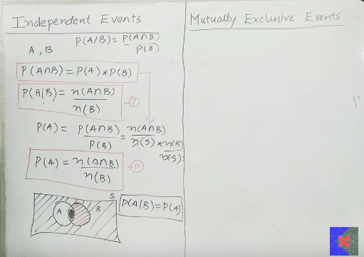

 

# `# Class Three:`
 

- Mutually Exclusive 

 

# `# Class Four:`
 

- Bayes Thorem:

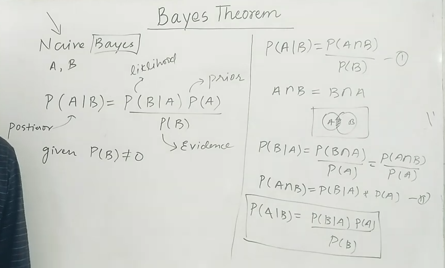

### [Machine_Learning_Math](https://github.com/yasin-arafat-05/jupyterNotebook/blob/main/MathForML/probability/note.md) 

Prerequsite পড়ার সময় আমরা উপরের 4টা class এর যা কিছু আছে তা পড়েছিলাম । উপরের link এ click করে আরেকবার revesion দিয়ে আসি চলো । 

 

# `# Class Five: (Problem base on Bayes Theorem)`

 

**Question:** ১টা factory এর ৩টা machine থেকে M1=20%, M2=30%, M3=50% produce হচ্ছে। যার মধ্যে, M1 এর 5%, M2 এর 3% and M3 এর 1% defacet ।  এখন,  প্রশ্ন হচ্ছে, আমি যদি 1টা product randomly select করি তাহলে, সেইটা M3 এর defacet হওয়ার possibility কত? 

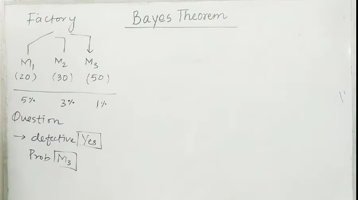

**hints:** M1 এর 5% defacet এর মানে হচ্ছে P(D | M1 ) = 5/100 ,আমরা বের করবো P(M3 | D)? 

**ANS:**  

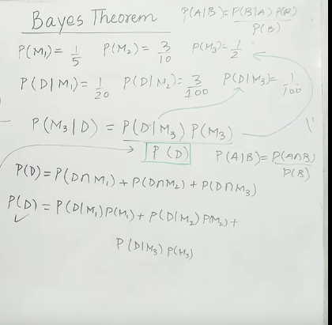

 

# `# Class Six: (ML Problem base on Bayes Theorem)`

 

নিচের table এ csk এর toss,venue,outlook(weather) এর উপর ভিত্তি করে, match এর result দেওয়া আছে । এখান থেকে খুব সহজেই বুঝা যাচ্ছে যে, input coloumn (toss,venue,outlook,result) এর target column হচ্ছে result । এখন, naive bayes ব্যবহার করে আমাদের এমন একটা classifier বানাতে হবে যেইটা toss,venue,outlook ইনপুট হিসেবে দিলে output match result দিবে । 

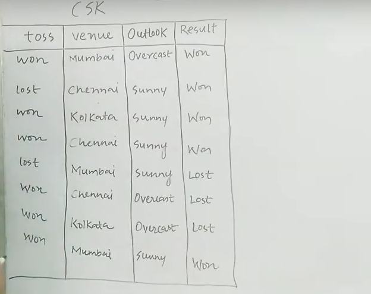

আমাকে বের করবে হবে যে, P(Wining | lost ∩ Mumbai ∩ Sunny), P(Lost | lost ∩ Mumbai ∩ Sunny) and P(Draw | lost ∩ Mumbai ∩ Sunny) .এই probability এর মধ্যে যারটা বেশি আসবে naive bayes একে ans হিসেবে দিবে । অনেক জায়গায় কমা ব্যবহার করা হয় । P(Wining | lost, Mumbai, Sunny) । 

আমরা যদি,  P(Wining | lost ∩ Mumbai ∩ Sunny) বা P(Lost | lost ∩ Mumbai ∩ Sunny) যার উপর naive bayes apply করি না কেন । আমাদের denominator এ সবসময় same value থাকবে । তাই, উপরে numerator নিয়ে কাজ করবো । P(lost,mumbai,sunny|w) * P(w) এখানে,  P(lost,mumbai,sunny) যখন CSK জিতেছে । কিন্তু, আমাদের example এ এমন কোন ডাটা নেই । তাই এর probability zero । এখন, কথা হচ্ছে, এইটা কোন  meanning bear করে না   । এর মান শুন্য যাতে না হয় এর জন্য bayes এর আগে naive একটা simplified assumption দেয়।  P(lost,mumbai,sunny|w) = P(lost|w) * P(mumbai|w) * P(Sunny|w) * P(w) । 
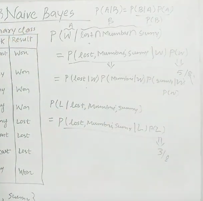

এখন, আমরা খুব সহজেই  value গুলো বের করতে পারবো । আর, এখন যার value বেশি হবে সেইটায় আমাদের ans।
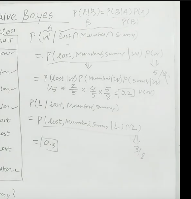

 

# `# Class Seven: (Math Behind Naive Bayes)`

 

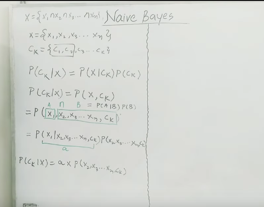

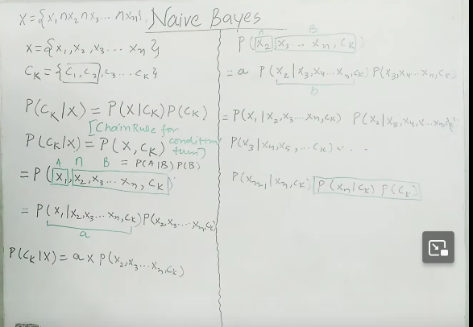

মোটামুটি base theorm দিয়ে simplify করেছি । এখন naive এর assumption কীভাবে ধরে নেওয়া হয়েছে সেইটা দেখবো । 

আমরা আগের ক্লাসে enough ডাটা না পাওয়ার কারণে যে, probability zero এসেছিলো সেইটাকে cope up করার জন্য event কে conditional independence ধরে নিয়েছিলাম । এখানেও তাও করবো , শুধু last term $C_K$ টা বাদে । 

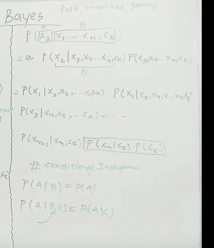

Now,final formula,

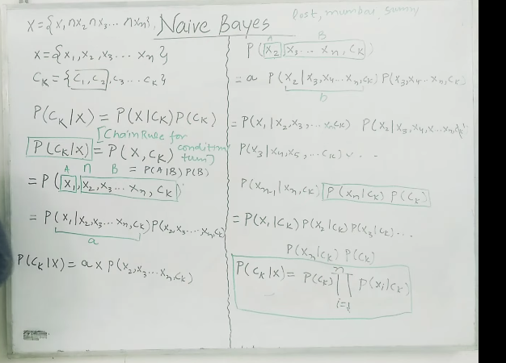

 

আমরা denominator বাদ দিয়েছিলাম । অরথাত, আমাদের final ans হবে নিচের মতো । 
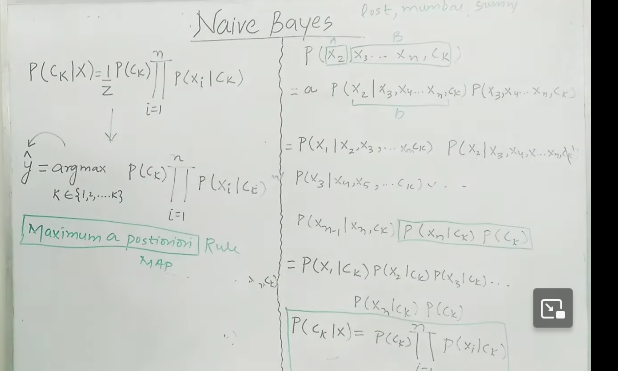

 

# `# Class Eight: (Code Example)`

 

- Implement code: 

 

# `# Class Nine: (Numerial Data in  Example)`

 

`আমরা তো এখনক্ষন দেখেছি যে আমরা categorical  data এর উপর কীভাবে naive bayes apply করতে হয় । এখন আমরা দেখবো যদি neumerical data থাকে তাহলে সেইটা কিভাবে apply করা হয় । `

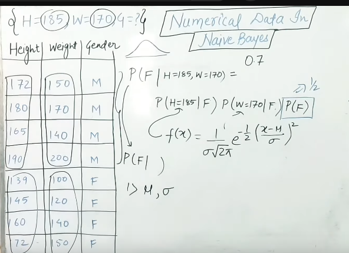

এখানে, আমাদের query point {H=185,W=170,Gender=?} । আগের মতো formula প্রয়োগ করবো । কিন্তু, এখানে, H=185 বলে কোন ভ্যালু নাই । তাই, male এর Probability বের করার জন্য আমরা male এর ভ্যালু গুলো কে  gaussian distributed random variable ধরে কাজ করবো । তখন, আমরা, x=185, probality বের করতে পারবো । একইভাবে,   আমরা female এর জন্য Probability calculate করে যার টা সবচেয়ে বেশি হবে সেইটাই হবে আমরা ans । 

 

