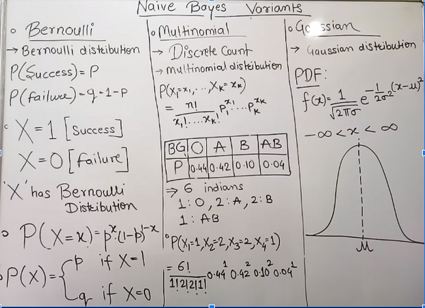

 

`**First, we need to lean some basic:**`

# **1. শুরুতে আমরা জানবো,**
- Random Variable
    - Discreate Random Variable
    - Continuous Random Variable
- Probability Distribution
- Probability Distribution Function
- Types of Probability Distribution Function(PMF(DiscriteRandomVaribale),PDF(DiscreateDensityFunction))

## **উপরের topic গুলো আমি MathForML এর lecture:3 তে পড়েছি । [notelink](https://github.com/yasin-arafat-05/jupyterNotebook/blob/main/MathForML/Statistics/note/02_lecture.md)**

## **Example 01: Probability Mass function:**
f(x) = x-2/2 for, 1,2,3,4 is f(x) a PMF?

**ANS:NO, for 4-2/2= -ve, the value of PMF can't be negative.**

`**আমরা তো, discreate random variable এর জন্য probability distribution  table থেকে probablity mass function বের করি । এখন, যেহেতু, আমরা, problity নিয়ে কাজ করতেছি । আর, probability এর মান (0~1) এর মধ্যে হয় । আর, কোন একটা particular event এর জন্য সকল sample space এর probablity যোগ করলে ১ হবে । এই দুইটা condition যেই function মেনে চলবে সেইটা হবে আমার probability mass function. value: 4 এর জন্য -2 এসেছে । তাই, আমাদের, উপরের function টা probability mass function নয় ।**`

## **Example 02: Probability Mass function:**
f(x) = x^2/25 for, x=0,1,2,3,4 is f(x) a PMF?

**ANS: NO, sum of all sample space = 6/5 >1**

## **Example: 03 we are given a probability distribution table for a probability mass funciton** **then find the value of K.**

| x    | 0  | 1  | 3  | 4  | 5  | 6  | 7       |
|------|----|----|----|----|----|----|---------|
|P(x)  | 0  | k  |2k  | 2k | 3k |k^2 |7k^2 + k |

 

**Soln:**  
`#Step01: Find the value of K:`  
For a discrete random variable, the sum of the probabilities over all possible values of x must equal 1:

$\sum P(x)$ = 1

So, we sum the probabilities given in the table:

$=> 0 + k + 2k + 2k + 3k + k^2 + (7k^2 + k) = 1$
$=> 8k^2 + 9k = 1$

This gives two solutions:
k_1 = $\frac{-9 + \sqrt{113}}{16}, \quad k_2 = \frac{-9 - \sqrt{113}}{16}$

`#Step02: Interpret the solutions:`

Since \( k \) represents a probability component, it should be non-negative (as probabilities are non-negative). Let's evaluate the two solutions:

- $\sqrt{113} \approx 10.63$
- $k_1 = \frac{-9 + 10.63}{16} = \frac{1.63}{16} \approx 0.1019$, which is positive.
- $k_2 = \frac{-9 - 10.63}{16} = \frac{-19.63}{16} \approx -1.2269$, which is negative.

Since,k  must be non-negative, we discard $k_2$ and take:

$k = \frac{-9 + \sqrt{113}}{16}$

 

# **2. এরপর আমরা জানবো,**
- Expected value:

 

Suppose a discreate random value X, assumes the value 
x1 x2 ... xN and corresponding probabilitics,
p1 p2 ... pN,
Then the expectation of X or expected value of X denoted by E(X) or miu 

$E(X) = \sum_{i=1}^N x_i p_i$

## `Example: 01 of Expected value:`
**Question:** A dice is tossed thhree times. We consider success as tossing 1 or 6. Find the mean of success. `arithematic mean = expected value, in some senrio`

**Step1: Understand the Full Sample Space of the Experiment:**
First, let’s look at the **full sample space** of the experiment, which consists of all possible outcomes when tossing a coin three times. Each toss has 2 possible outcomes (H or T), and there are 3 tosses, so the total number of outcomes is:

**2^3 = 8**

**Let’s list all possible outcomes (sequences of heads and tails):**

- Toss 1, Toss 2, Toss 3:
  1.  HHH  (3 heads),
  2.  HHT  (2 heads),
  3.  HTH  (2 heads),
  4.  HTT  (1 head),
  5.  THH  (2 heads),
  6.  THT  (1 head),
  7.  TTH  (1 head),
  8.  TTT  (0 heads).

## **Random Varibale of this problem is X and X = {0 1 2 3}:**

A fair die has 6 faces (1, 2, 3, 4, 5, 6), each with a probability of $\frac{1}{6}$.

- Probability of success (rolling a 1 or a 6):
  $P(\text{success}) = P(\text{roll a 1}) + P(\text{roll a 6}) = \frac{1}{6} + \frac{1}{6} = \frac{2}{6} = \frac{1}{3}$

- Probability of failure (rolling a 2, 3, 4, or 5):
  $P(\text{failure}) = 1 - P(\text{success}) = 1 - \frac{1}{3} = \frac{2}{3}$

$P(X=0) = P(\text{zero successes}) = \frac{2}{3} \times \frac{2}{3} \times \frac{2}{3} = \frac{8}{27}$

$P(X=1) = P(\text{one success}) = \left(\frac{1}{3} \times \frac{2}{3} \times \frac{2}{3}\right) + \left(\frac{2}{3} \times \frac{1}{3} \times \frac{2}{3}\right) + \left(\frac{2}{3} \times \frac{2}{3} \times \frac{1}{3}\right) = \frac{12}{27}$

$P(X=2) = P(\text{two successes}) = \left(\frac{1}{3} \times \frac{1}{3} \times \frac{2}{3}\right) + \left(\frac{1}{3} \times \frac{2}{3} \times \frac{1}{3}\right) + \left(\frac{2}{3} \times \frac{1}{3} \times \frac{1}{3}\right) = \frac{6}{27}$

$P(X=3) = P(\text{three successes}) = \frac{1}{3} \times \frac{1}{3} \times \frac{1}{3} = \frac{1}{27}$

**Probability Distribution:**

| x    | 0     | 1     | 2     | 3     |
|------|-------|-------|-------|-------|
|p(x)  | 8/27  | 12/27 | 6/27  | 1/27  |

$E(X) = \sum_{i=0}^3 x_i p_i$ = 0*(8/27) + 1*(12/27) + 2*(6/27) + 3*(1/27) = 1

 

# **2. এরপর আমরা জানবো,**
- Variance and Standard Deaviation of Discreate Probability Distribution:
 

Measure of dispersion (How much data is spread from the mean): 
**i)** Variance: σ² = Σ(x - μ)² / N  `(For population)`
**ii)** Standarad Deaviation: σ = √(Σ(x - μ)² / N)  `(For population)`

 

# Naive Bayes Variants : Bernoulli Naive Bayes

#### [link](https://www.youtube.com/watch?v=ZxbF0qDe-pw&list=PLYwpaL_SFmcBhOEPwf5cFwqo5B-cP9G4P&index=30)

 
 

-  আমদের কাছে কোন dataset আছে যার feature হলো binary nature এর তখন আমরা সেইখানে Bernoulli Naive Bayes  প্রয়োগ করি । 

-  Binary nature means: 0 or 1, Ture or  False, Yes or No, Success or Failure 

Bernoulli Distribution: 

In probability theory and statistics, the Bernoulli distribution, named after Swiss mathematician Jacob Bernoulli, is the discrete probability distribution of a **random variable** which takes the value 1 with probability  P and the value 0 with probability Q=1-P. 

