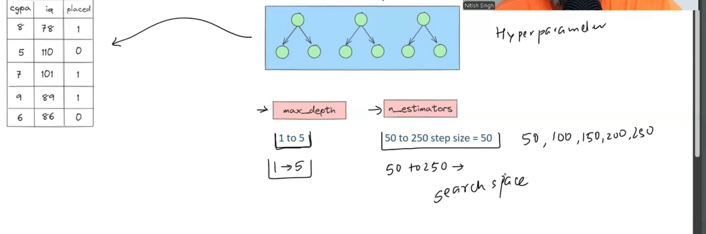
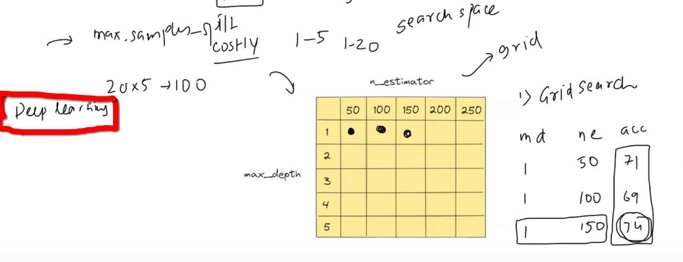
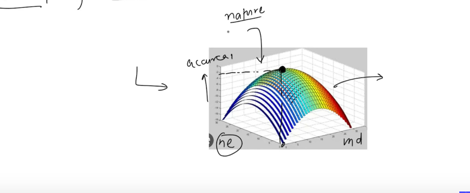
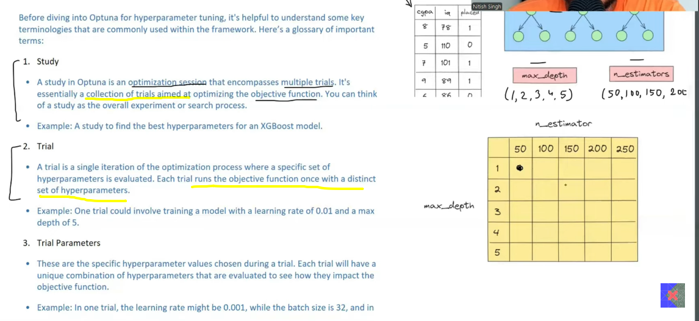
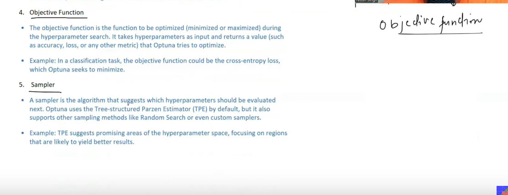

<br>
<br>

# `# Hyperparameter Tunning, Bayesian Optimization: Optuna`

<br>
<br>

### `#01 Why we learn Optuna?`

**আমাদের কাছে, gridSearchCV, RandomSearchCV থাকার পরেও কেন আমরা optuna পড়তেছি ?**

Okay, let's take an example. আমাদের কাছে, cgpa,iq,placement নিয়ে একটা dataset আছে যেখানে আমরা RandomForest apply করবো ।  এখন, random forest এ অনেক গুলো hyperparameter থাকে, তারমধ্যে আমরা, max_depth(depth of decision tree) and n_estimator(Number of decision tree) এই দুইটা নিয়ে কাজ করবো । 




**Search Space:** আমরা তো নিজেদের মতো hyperparameter এর মান গুলো দিতে পারি । প্রথমে আমরা ঠিক করবো যে কোন range এর মধ্যে max_depth and n_estimator এর মান গুলো থাকবে । একে আমরা search space বলতেছি । max_depth এর জন্য (1-5)-> 1,2,3,4,5 and n_estimator এর জন্য (50-250)->50,100,150,200,250 এই  value  গুলো নিয়ে কাজ করবো । 


এখন, search space টা দেখতে হবে নিচের মতো । আমাদের পরের কাজ হচ্ছে যে, আমাদের serach space এর table এর জন্য সকল combination try করা এবং এখান থেকে best result বের করে আনা । 




ধরি, আমাদের result নিচের মতো হবে এবং max_depth = 1 and n_estimator=150 এর জন্য আমরা best result টা পাবো  । 


```table
| max_depth | n_estimator |  accuracy |
    1           50          71
    1          100          69
    1          150          75
    .          ...          ..
    .          ...          ..
    .          ...          ..
    5          250          50
```

**Disadvantage:** <br>
-  আমাদের অনেক সময় লাগবে সব combination try out করতে । 
- আমরা বেস্ট result পাবো, কিন্তু, অনেক time and resources লাগবে । 
- দুইটার জায়গায় তিনটা paramter নিয়ে কাজ করলে , 3*5*5=75 বার model টা train করা লাগবে । 
- Deep learning এর ক্ষেত্রে, যেখানে একবার model train করা অনেক সময় সাপেক্ষ সেখানে তো এত বার করার কোন প্রশ্নই উঠে না । 

<br>

`**উপরের ,disadvante গুলো থেকে মুক্তি পাবার জন্য এসেছে RandomSearchCV । যেখানে, আমরা gridSearchCV এর মতোই combination try out করি, কিন্তু randomly । এর সুবিধা হলো time কম লাগবে আর best hyperparameter এর ভ্যালু গুলো পেতে পারি । আর, অসুবিধা হলো যেহেতু random তাই best hyperparamter এর value নাও পেতে পারি । 
**`

<br>

**That's why we need OPTUNA:**
- Optuna use a different kind of search called **Baysian Search. (based on mathmatics and probability.)**
- We use gridSearch in GridSearchCV and random Search in RandomSearchCV.

## **OPTUNA:**

OPTUNA বলে, যদি  max_depth and n_estimator change করলে যদি accuracy change হয় তাহলে accuracy = f(max_depth and n_estimator) ।  হতে পারে, accruacy এর সাথে, max_depth and n_estimator এর relation এর গ্রাফ দেখতে নিচের মতো: 



আর, optuna  accruacy এর সাথে, max_depth and n_estimator এর relation বের করে, maxma বের করে, কারণ, graph এ z-axis এ accuracy আর আমাদের দরকার maximum accruacy ।  

**How to imagine the graph?** grid search এর Gird table থেকে Optuna কয়েকটা combination এর জন্য accuracy বের করে।  পাশাপাশি, কোন কোন hyperparameter জন্য accuracy কেমন behave করতেছে সেইটাও খেয়াল করে **(যেইটা আগের দুইটা search gridSeach and randomSearch এ আগের কোন accuracy ব্যবহার করতো না)** predict করার চেষ্টা করে, এর পর কোন hyperparameter এর combination try করলে mathematical function এর কাছাকাছি যেতে পারবে । 

**Here, we will not cover the mathematical term of Bayesian search.**

<br>

#  `# Key terms to we need to know to learn OPTUNA:`

<br>



`**Let's take the same example, iq,cgpa,placement and the algorithrm is Random Forest.**`

**1. Trail:** A single try or perfrom a test of a single value of n_estimator and max_depth.

**2. Study:** Collection of trails.

**3. Trial parameter:** Specific parameter value in our case the value of n_estimator and max_depth for a trial.




**4. Objective Function:** The relationship among n_estimator and max_depth.

**5. Sampler:** Sampler is somthing like an algorithrm which tell base on current all situation or previous all the accuracy along with hyperparameter in our case max_depth and n_estimator what should be next hyperparameter value of max_depth and n_estimator. So, that we get the best result .  By deafault in **OPTUNA RESEARCH PAPER** they use `TPE(Tree-structured-parzen-Estimator)`. 


# `# Code Example:` 
- we can also do gridsearch and randomsearch with OPTUNA


# `# Visulation that's helps us to understand better:`
- plot_optimization_history
- plot_parallel_coordinate
- plot_slice
- plot_contour
- plot_param_importances


# `# Define By Run:`

**Define by run feature হচ্ছে এর মাধ্যমে আমরা Dynamic Search Space তৈরি করতে পারি ।** উপরের, code example এ আমরা decision tree apply  করেছি । কিন্ত, normally হয় যে, আমাদের  একটা  dataset এ কোন ml algorithrm ভালো কাজ করবে সেইটা আমাদের জানা থাকে না । তাই, আমারা নানান ধরনের ml algorithrm try করে থাকি । এখন একটা particular dataset এর জন্য আমরা যদি 4 টা ml algorithrm run করি তাহলে আমাদের 4 বার hyperparamter tunning করতে হবে । কিন্তু, আমরা optuna একবার, hyperparameter tunning করলেই বুঝতে পারবো কোন  hyperparamters and কোন algorithrm best হবে এই dataset এর জন্য । **BUT HOW?**


আমরা algorithrm গুলোকে একটা hyperparameter হিসেবে treat করি । ধরি, algo = [svm,dt,lor,xgboost]  আমাদের model hyperparameter । তারপর, আমরা, svm এর জন্য hyperparamer গুলোর value বের করতে পারি । 

### Code example where we treat algorithrm as a hyperparameter.

- We can also use distributed computing with optuna.
- We can intregrate it with sklearn,tensorflow,pytorch and also for mlflow.


<br>

# 
# 

<br>

