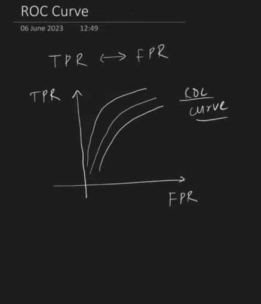
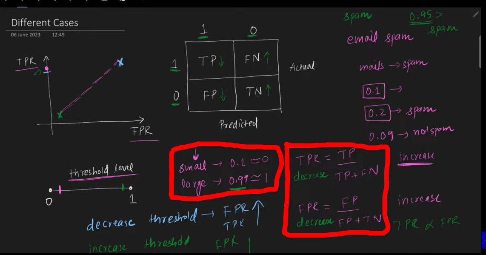
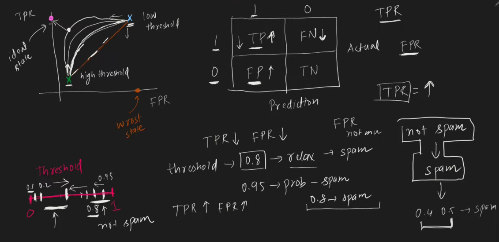

 
 

# `# ROC Curve in ML`

# `#01 Why we need ROC Curve?`

চলো, classification problem থেকে ঘুরে আসা যাক। Specificly, Binary classification problem । আমরা, যখন,  LoR এ classifictation scarch থেকে পড়ছি, তখন step function বা softmax function ব্যবহার করে classifictation problem এর যে আউটপুট পেয়েছি সেইটা probability term এ ছিল । তারপর, আমরা একটা `thesold` ধরেছিলাম 0.5 , যদি আমাদের classification এর output এর probability 0.5 এর সমান বা তার বেশি আসতো তাহলে তাকে class-1 and 0.5 এর নিচে থাকলে class-0 তে ফেলে output  বের করেছি । 

কিন্তু, এখন প্রশ্ন হচ্ছে যে, আমরা যে thesold 0.5 এ best result পাবো তার কোন  guarantee নেই । একেক ধরনের প্রবলেম statement এর ক্ষেত্রে আমরা এই thesold value change করে best result পেতে পারি । **For example:** Spam-Email-Classification এর ক্ষেত্রে, আমাদের যেই email গুলো spam না সে গুলোকে আমরা যদি spam বলে চালিয়ে দেয় তো আমাদের model এর performance ভালো হবে না । যদি, কোন important mail কে আমরা spam বলে চালিয়ে দেয় তাহলে তো আমরা বলতে পারবো না যে আমাদের model ভালো, তো আমরা thesold value বাড়িতে দিতে পারি এক্ষেত্রে । যেখানে, 0.5 ছিলো সেখানে অন্যকোন value let's say 0.7 অর্থাৎ তুমি 70% sure না হয়ে কোন mail কে spam বলে আখ্যায়িত করতে পারবে না । 

`**আর, এই কোন ml binary classification problem এর জন্য কোন theshold value টা বেস্ট হবে,  সেইটা বের করার জন্য আমরা ROC CURVE ব্যবহার করি ।**`

 

# `#02 Lets revice the Confusion Matrix with:`
- TPR
- FPR
- R1
- R2
- Recall 
- Precision

 

Confusion Matrix একটি টেবিল, যা মডেলের পারফরম্যান্স মূল্যায়ন করতে ব্যবহৃত হয়, বিশেষ করে Classification সমস্যায়। এটি মূলত চারটি মান নিয়ে কাজ করে: 
**1. True Positive (TP):** মডেল যা সঠিকভাবে পজিটিভ হিসেবে চিহ্নিত করেছে। 
**2. False Positive (FP):** মডেল ভুল করে পজিটিভ হিসেবে চিহ্নিত করেছে, কিন্তু আসলে এটি নেগেটিভ। 
**3. True Negative (TN):** মডেল যা সঠিকভাবে নেগেটিভ হিসেবে চিহ্নিত করেছে। 
**4. False Negative (FN):** মডেল ভুল করে নেগেটিভ হিসেবে চিহ্নিত করেছে, কিন্তু আসলে এটি পজিটিভ।

1️⃣ **True Positive Rate (TPR) বা Recall বা Sensitivity:**
TPR হচ্ছে আসল পজিটিভ ক্লাসের মধ্যে কতটুকু সঠিকভাবে শনাক্ত করা হয়েছে।
TPR = $\frac{TP}{TP + FN}$ 
উচ্চ TPR মানে মডেল কম False Negative দিচ্ছে, অর্থাৎ প্রকৃত পজিটিভগুলোকে ঠিকভাবে ধরতে পারছে।
Recall নামেও পরিচিত।

2️⃣ **False Positive Rate (FPR):**
FPR বোঝায় যে আসল নেগেটিভ ক্লাসের মধ্যে কতটুকু ভুল করে পজিটিভ হিসেবে শনাক্ত হয়েছে।
FPR = $\frac{FP}{FP + TN}$
উচ্চ FPR মানে মডেল অনেক ভুল পজিটিভ দিচ্ছে, অর্থাৎ নেগেটিভদের ভুল করে পজিটিভ হিসেবে শনাক্ত করছে।

3️⃣ **Recall Score (Sensitivity/TPR):**
Recall একই জিনিস যা TPR হিসাবে গণনা করা হয়:
Recall = $\frac{TP}{TP + FN}$ 
Recall বেশি হলে, মডেল আসল পজিটিভগুলোর বেশিরভাগকে ঠিকভাবে শনাক্ত করতে পারছে।
ক্যান্সার ডিটেকশনের মতো সমস্যায় Recall বেশি হওয়া গুরুত্বপূর্ণ, কারণ False Negative (FN) কম হলে মিস হওয়া কেস কমবে।

4️⃣ **Precision (R₁) বা Positive Predictive Value:**
Precision হল, মডেল যতগুলো পজিটিভ প্রেডিকশন দিয়েছে, তার মধ্যে আসলে কতগুলো সত্যিকারের পজিটিভ।

Precision = $\frac{TP}{TP + FP}$ 
Precision বেশি হলে, মডেল তার পজিটিভ প্রেডিকশনগুলোতে বেশি নির্ভরযোগ্য।
স্প্যাম ফিল্টারিং-এর মতো সমস্যায় Precision গুরুত্বপূর্ণ, কারণ False Positive (FP) কমাতে হবে, যাতে বৈধ ইমেইল স্প্যাম হিসেবে ধরা না পড়ে।

5️⃣ **F1-Score (R₂):**
F1-Score হল Precision এবং Recall-এর hurmonic mean (arithemetic mean, a+b/2) ।
F1 = $2 \times \frac{Precision \times Recall}{Precision + Recall}$
যখন Recall ও Precision এর মধ্যে ভারসাম্য দরকার, তখন F1-score ভালো মেট্রিক।
একটি মডেলের F1-score যত বেশি, ততই সেটি ভালোভাবে পজিটিভ ক্যাটাগরির নমুনাগুলো সনাক্ত করতে পারছে।

**সংক্ষেপে:**
**TPR (Recall):** আসল পজিটিভগুলোর মধ্যে কতগুলো সঠিকভাবে শনাক্ত হয়েছে।  
**FPR:** আসল নেগেটিভগুলোর মধ্যে কতগুলো ভুল করে পজিটিভ হিসেবে শনাক্ত হয়েছে।  
**Precision (R₁):** মডেল যতগুলো পজিটিভ প্রেডিকশন দিয়েছে, তার মধ্যে কতগুলো আসলে সত্যিকারের পজিটিভ।  
**F1-Score (R₂):** Precision এবং Recall এর ব্যালান্স করা স্কোর।
এইসব মেট্রিকস মডেলের পারফরম্যান্স ভালোভাবে বুঝতে সাহায্য করে, বিশেষ করে যখন False Positive (FP) এবং False Negative (FN) কমানো গুরুত্বপূর্ণ।

# `# ROC CURVE:`

**Remember:**
- We can say TPR as Benefit. 
- We can say FPR as Cost.

`**The graph between TPR vs FPR or  Benefit vs Cost call the ROC curve or Receiver Operating Characteristic curve** In Y-axis we have the TPR and X-axis we have the FPR`

- Ideally, We want TPR=1 or FPR=0 . 

# `# Is the relation between TPR and FPR is linear?`

ধরি, 
theshold = 0.1 or less,
যদি আমরা  spam-email-classification প্রবলেম নেই তাহলে, 
theshold কম হলে, আমরা বেশি সংখ্যক email কে spam বলতেছি । এতে, TP কমবে আর FN বাড়বে ফলে TRP বাড়বে । 
Simillary, FRP বাড়বে । 

thesold = 0.9 or greater,
TP বাড়বে আর FN কমবে ফলে, TPR কমবে । কারণ, নিচে, TP+FN আছে । 
একই ভাবে FPR কমবে । 

উপরের, থেকে আমরা মোটামুটি ধারণা করতে পারি যে, হয়তো, TRP আর FRP এর মধ্যে linear relation বিদ্যমান । কিন্তু, এইটা আসলে সত্য নয় । 

এখন, আমরা 0.95 এর চেয়ে ছোট ভ্যালু নিয়ে দেখবো যে, TPR অনেক কম কমতেছে আর অন্যদিকে FPR বেশি কমতেছে যেইটা আগে আমরা linear ভাবছিলাম সেইটাকে মিথ্যা প্রমান করছে ।   
অন্যদিকে, 0.1 এর থেকে একটু বড় ভ্যালু নিলে সেইটা TPR কে বাড়তেছে কিন্তু FPR অনেক কম বাড়তে । তাই, finally data এর  উপর depend করে গ্রাফ টা উপরের দিকে একটু বেকে যাবে । আর যেহেতু, TRP=1,FPR=0 থেকে গ্রাফের যে ভ্যালু টা পাবো সেইটায় হবে theshold  এর ভালো ভ্যালু । 

 

# `# Code Example:) `

 

# `# AUC-ROC`

Mainly, we will find the area under the curve and we can compare two model with same dataset.

 

# `#Code Example of AUC-ROC`

 
