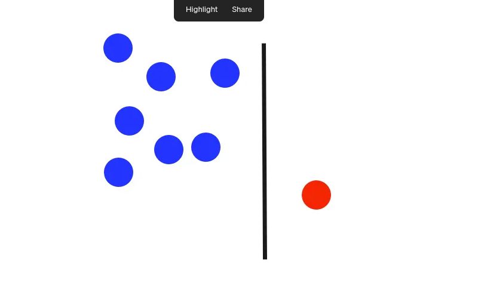
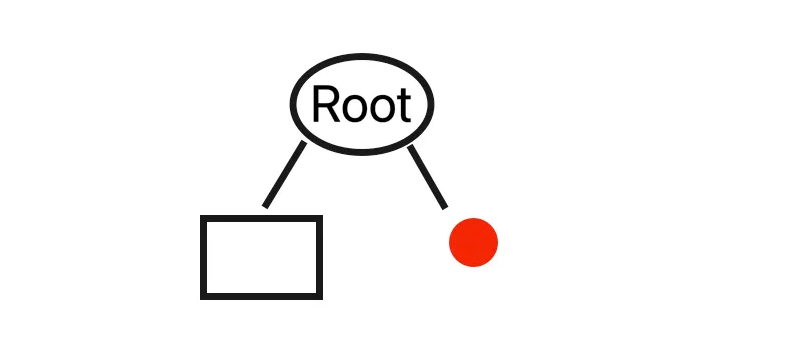
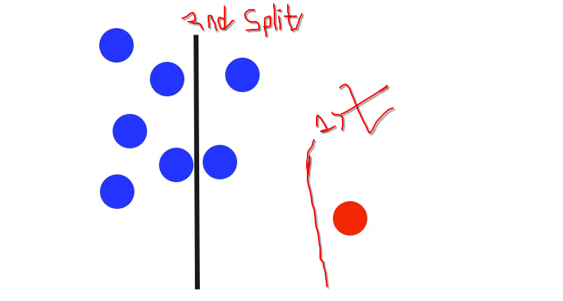

 
 

# `#01: Isolation Foreset`

 
 

## `#Use case of Anomaly Detection:`

 

Basically, there are two type of use case in **anomaly detection**:

### 1. When Outliers are Bad Data (Noise)

In this case, outliers are erroneous or anomalous data points that can harm the model's performance. For example, in the NYC Taxi Trip Prediction, a 5-day trip or an unusually large distance is considered an error. Our goal here is to create a robust model for normal trips, so we **identify and remove** these outliers from the dataset. This is the common use of **Anomaly Detection**.

### 2. When Outliers are the Main Target

In some cases, the anomalous data points are our primary interest. These outliers are the core output of our model. Here, we do not remove the outliers; rather, we build a model that can correctly identify them. For example:

* **Fraud Detection in Banking:** A fraudulent transaction is an outlier among hundreds of normal transactions. Our model's job is to pinpoint these outliers.
* **Medical Diagnosis:** A rare disease or an unusual health condition is an outlier among normal data points. The objective of doctors or researchers is to find these outliers.
* **Machine Fault Detection:** An unusual vibration or temperature of a machine is a sign of a potential fault, which is an outlier in the normal operational data. The model is trained to recognize this abnormal behavior.

Therefore, whether you perform **anomaly detection** depends on your project's **goal**. If the anomalous data is an error for your model, you remove it. If the anomalous data is the very thing you want to predict, you build a model that is capable of identifying it.

 
 

# ISOLATION FOREST:

Isolation Forest is an unsupervised machine learning algorithm for anomaly detection. As the name implies, Isolation Forest is an ensemble method (similar to random forest). In other words, it use the average of the predictions by several decision trees when assigning the final anomaly score to a given data point. Unlike other anomaly detection algorithms, which first define what’s “normal” and then report anything else as anomalous, Isolation Forest attempts to isolate anomalous data points from the get go

# Algorithm:

**Suppose, we had the following data points,**

**The isolation forest algorithm selects a random dimension (in this case, the dimension associated with the x axis) and randomly splits(like what to read in decision tree algorithrm) the data along that dimension.**

**The two resulting subspaces define their own sub tree. In this example, the cut happens to separate a lone point from the remainder of the dataset. The first level of the resulting binary tree consists of two nodes, one which will consist of the subtree of points to the left of the initial cut and the other representing the single point on the right.**

**It’s important to note, the other trees in the ensemble will select different starting splits. In the following example, the first split doesn’t isolate the outlier.**

`যেহেতু, outliers গুলো অনেক দূরে থাকে, তো আমরা যে random split করি,  এতে outliers গুলো tree এর leaf node হওয়ার possibility বেড়ে যাই । ফলে,  কম depth এ যে leaf node গুলো থাকে সেই node গুলোর  outliers হওয়ার possibility বেড়ে যাই ।    Isolation Forest এ আমরা অনেক গুলো tree তৈরি করি ।   আর, কোনটা একটা node outliers কিনা তা যাচাই করার জন্য আমরা anomaly score বের করি । নিচের formula দিয়ে । আর, আমরা যেহেতু অনেক গুলো tree বানাই তো আমরা average measurement নিয়ে কাজ করি ।    `

 

# Formulation:
The formula used to calculate the anomaly score for a given data point `x` is:

$s(x, n) = 2^{- \frac{E(h(x))}{c(n)}}$

Where:

* $s(x, n)$ is the **anomaly score**. A score close to 1 indicates a high probability of being an anomaly. A score much smaller than 0.5 indicates a normal observation.

* $E(h(x))$ is the **average path length** of instance `x` across all the isolation trees. The path length, h(x), is the number of edges (splits) that must be traversed to reach the leaf node of the instance.

* $c(n)$ is the **average path length of an unsuccessful search** in a Binary Search Tree (BST) for a dataset of size `n`. This is a normalization constant that makes the score comparable across different datasets. It is calculated using the following formula:

$c(n) = 2H(n-1) - \frac{2(n-1)}{n}$

where $H(i)$ is the harmonic number, which can be approximated as $\ln(i) + \gamma$ (where $\gamma$ is Euler's constant).

In essence, the anomaly score is an inverse relationship with the average path length. **The shorter the path length ($E(h(x))$), the higher the anomaly score** because the data point was "isolated" more easily.

**class sklearn.ensemble.IsolationForest()**

 
 

## Also we can find Anomaly Detection using **DBSCAN**, **Local Factor Outlier**

 
 
