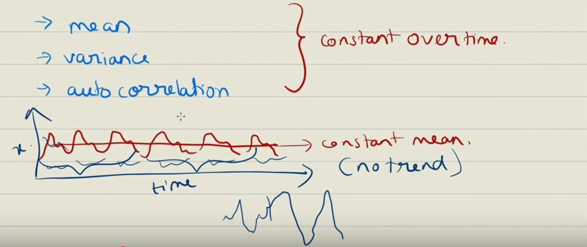
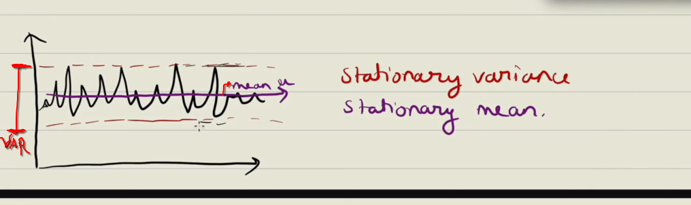
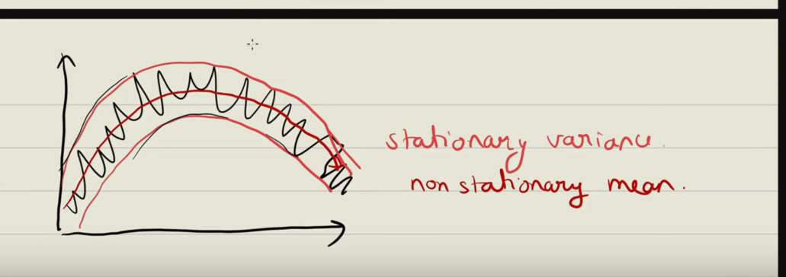
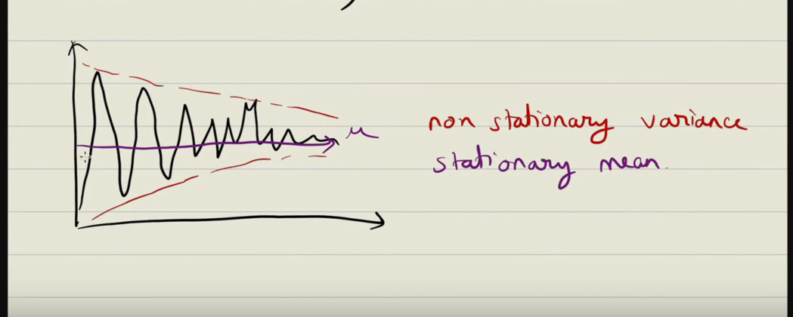
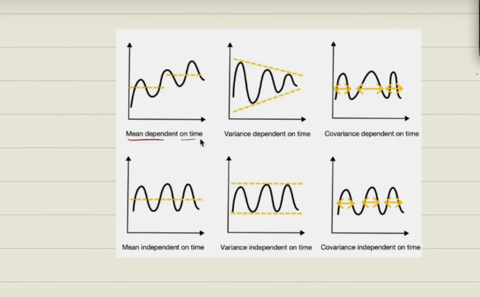
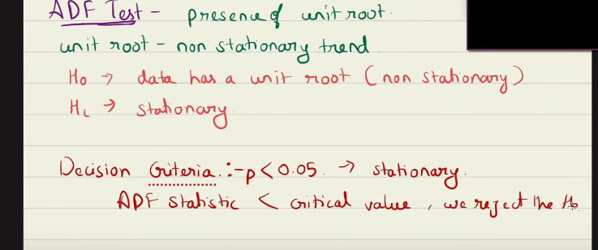
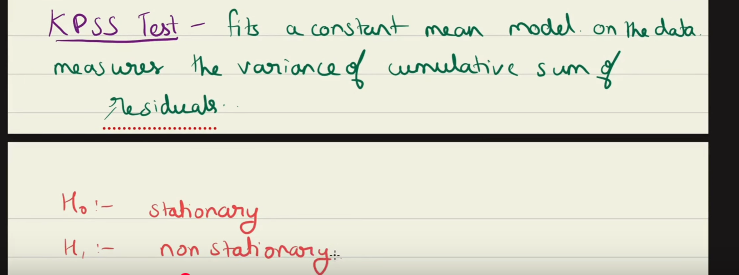
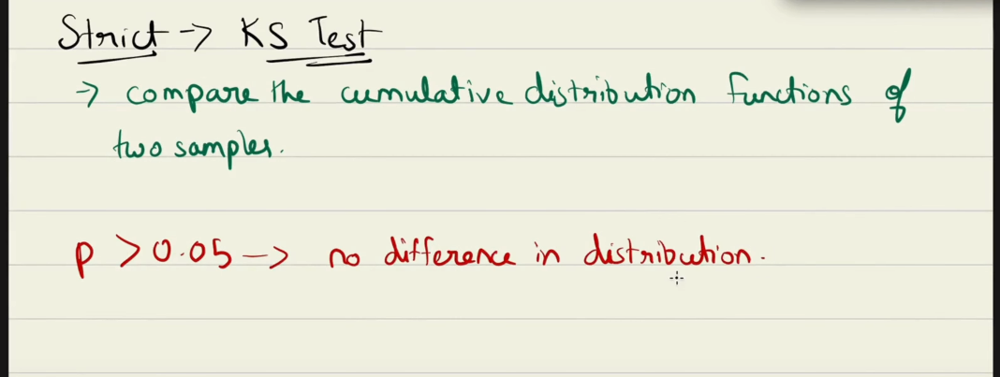
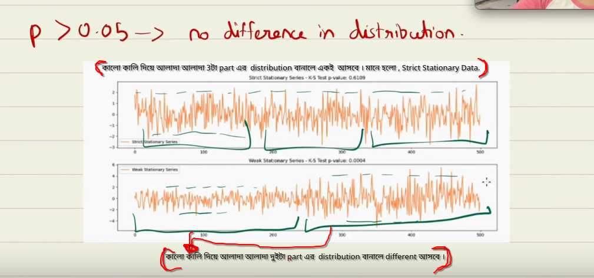

 

# `#Time Series Analysis?`

 

**1. What is Time Series Data and Time Series Analysis?**
- Definition
- Real Life examples
- Key characteristics of time series data
- Goals of Time series analysis

**2. Time Series Decomposition:**
- Trend
- Seasonality
- Cyclic
  - Economic Cycles
    - Business Cycles
- Residuals
- Types of decomposition model
    - Additive
    - Multiplicative

**3. STL Decomposition (Seasonal and Trend Decomposition using LOESS):**
- How does it differ from classical decomposition?
- Choosing the right decomposition method

**4. Stationarity:**
- Why do we need stationarity?
- Types of stationarity
    - Strict stationarity
    - Weak stationarity
- Testing for weak stationarity
    - Augmented Dickey Fuller (ADF) Test
    - Kwiatkowski–Phillips–Schmidt–Shin (KPSS) test
- Testing for strict stationarity
- Which one to choose?
- Making a time series, Stationary
    - Differencing
        - First order
        - Second order
    - Transformation
        - Logarithmic
        - Power
        - Box–Cox
    - De–trending
        - Linear
        - Moving Average
- Seasonal Adjustment
- Choosing the right method

**5. White Noise and Random Walk:**
- White noise
  - Characteristics
- Random Walk
  - Characteristics
- Identifying white noise and random walk

**6. Time Series Forecasting Models:**
- Autoregressive (AR)
- Moving Average (MA)
- Autoregressive Moving Average (ARMA)
- Autoregressive Integrated Moving Average (ARIMA)
- Seasonal Autoregressive Integrated Moving Average (SARIMA)
- Vector AutoRegressive (VAR)
- Vector Moving Average (VMA)
- Vector AutoRegressive Moving Average (VARMA)
- Vector AutoRegressive Integrated Moving Average (VARIMA)

**7. Smoothing Methods:**
- Importance of Smoothing
- Moving Average
  - Simple Moving Average (SMA)
  - Weighted Moving Average (WMA)
  - Exponential Moving Average (EMA)
- Exponential Smoothing (ES)
  - Selecting alpha
  - Single Exponential Smoothing (SES)
  - Double Exponential Smoothing or Holt’s linear (DES)
  - Triple Exponential Smoothing or Holt-Winters (TES)
- Difference between EMA and ES

**8. Granger causality test:**

**9. Autocorrelation and Partial Autocorrelation Function:**
- ACF
- PACF
- Key difference from ACF
- Order of models (p, d, q, m)
- Identifying models from ACF and PACF

**10. Model Evaluation Metrics:**
- Mean Absolute Error (MAE)
- Mean Squared Error (MSE)
- Root Mean Squared Error (RMSE)
- Mean Absolute Percentage Error (MAPE)
- Akaike Information Criterion (AIC) and Bayesian Information Criterion (BIC)

**11. Data Preprocessing:**
- Handling Missing Values
- Making data stationary
- Handling Outliers
- Resampling

 
 

# **1. What is Time Series Data and Time Series Analysis?**

 
 

**Time Series Data:** Ovservations collected over a sequence of time intervals. And this time inverval may be in daily, weekly, secons or monthly basis. For example: in the below image, there have an date that means it's a time series data. And time intervals:

Example of time series data:
- Stock Price 
- Sales Data
- Weather Data
- Our Social Media data

**Characteristics:**

`I. Chronological Order: Regular Intervals:`
*   **Simple Meaning:** The data is a list of events recorded at specific, evenly spaced times.
*   **Example:** The temperature reading taken at a weather station **every day at 12:00 PM**. The "regular interval" is one day. Another example is a company's **total sales at the end of every month**. The interval is one month.

`II. Sequential Order: Current Observation Depends on the Past:`
*   **Simple Meaning:** What happens today is influenced by what happened yesterday, last week, or last year. The order of the data points is crucial because they are connected.
*   **Example:** **Stock Prices.** The price of a stock today is heavily influenced by its price yesterday and the days before. If you scramble the order of the days, the data becomes meaningless.

`III. Temporal Components: Trend, Seasonality, Cycle, Noise:`
This is about breaking down the data into different patterns:
*   **Trend:** The long-term overall direction. Is it generally going up or down over a long period?
    *   *Example:* The **steady increase in global average temperature** over 50 years.
*   **Seasonality:** A pattern that repeats at a fixed, known interval (like a calendar).
    *   *Example:* **Sales of ice cream** go up every summer and down every winter. The "season" is one year.
*   **Cycle:** Up-and-down patterns that don't have a fixed calendar interval. They are longer than seasonal patterns and their duration can vary.
    *   *Example:* **Economic booms and recessions.** They happen repeatedly but not on a perfect, predictable calendar schedule (e.g., every 7 years).
*   **Noise (or Residual):** The random, unpredictable "jitter" left over after accounting for the trend, seasonality, and cycles.
    *   *Example:* A sudden, unexpected drop in ice cream sales on a hot day because the local factory had a power outage. It's the random luck or chance element.

`IV. Constant Frequency: Continuous Data Without Any Missing Value:`
*   **Simple Meaning:** The data is "clean" and comes in like clockwork. There are no gaps or jumps in time.
*   **Example:** A sensor that measures room temperature and **successfully saves a reading every single minute without fail**. The "frequency" is one minute, and it's constant.

`V. Dynamic Nature: Affected by External Factors`
*   **Simple Meaning:** The time series doesn't exist in a vacuum. It can be suddenly changed by outside events.
*   **Example:** **Website Traffic.**
    *   Normally, it might have a seasonal pattern (e.g., higher on weekends).
    *   But if a famous influencer shares a link to the site (**external factor**), traffic will suddenly and dramatically spike in a way that had nothing to do with its previous patterns.

`**Time Serics Analysis is a Statistical technique where we find meaninful insights about patterns and trend. Main task is understanding the past and forcast the future. For example: If we work for an ecommerce company, then understand the past data like sales, user engagement etc. We forcast the future like, what action the company should take to incrase their sales.**`

`**Mostly, In time serics data we draw **Line Chart**. Above we draw a Line Chart. Then is another chart named **Candle Stick Chart.**`

 
 

# **2. Time Series Decomposition:**

 
 

`We previously read Temporal Components(Trend, Seasonality, Cycle, Noise/Residuals). This means we can decompose the time serics data into 4 parts i) Trend ii) Seasonality iii) Cycle iv) Noise/Residuals.`

**i. Trend:** Behaviour of the graph. Upward, downward or remaning same.

`In the above graph,from  mid of January to Mid of April the trend is **Downword** and from mid of April to July the trend is **Upword** . `

**ii. Seasonality:** Repeating pattern at fixed intervals. 

`Almost similar pattern, like in above image, the month (06-07) and the month (07-08) almost similar pattern. And for the both cases, from beginning of the months(fixed intervals).Like, see of AC increate in summer and decrese in winter.It's a seasonality.`

**iii. Cyclic:** Different from seasonality, will be repeat the pattern but not in fixed time intervals that happen in seasonality. There are two cycle
- Economic 
- Business 

**iv. Residuals/Noise:** Suddden fluctuation.

`Marked circle is a residuals or Noise.`

 

`**Type of decomposition Model:`

There are two types of decomposition model,
- Additive 
- Multiplicative

The two main types of **Time Series Decomposition** models: **Additive** and **Multiplicative**. The Additive model represents the time series as a sum of its components ($Y_t = T_t + S_t + R_t$), while the Multiplicative model represents it as a product of its components ($Y_t = T_t \cdot S_t \cdot R_t$).

`In 1st, image trend is increasing. But, the seasonality is also increase by the time.This type of model is called Multiplicative model. On the other hand, the second image is a additive model, trend is increasing but seasonality is fixed.`

`Here, our decomposition model is addtitive in the upwording trend.`

**Classicial Decomposition:**
## [01_Classifical_Decompostion](https://github.com/yasin-arafat-05/machine_learning/blob/main/code/136_time_serics.ipynb)

 
 

# `#3. STL Decomposition (Seasonal and Trend Decomposition using LOESS):`
 
 

**STL Decomposition using (LOESS):**
- LOESS - Locally Estimated Scatterplot Smoothing
- Difference Between Classicial vs STL Decomposition:
    - Classicial give us fixed seasonal pattern always, on the other hand STL give us the actual seasonal pattern.
    - Classicial easily influence by outliers, but STL does not.
    - Classicial can work with both(additive,multiplicative) but on the other hand STL work only (additive).
## [02_STL_Decomposition](https://github.com/yasin-arafat-05/machine_learning/blob/main/code/136_time_serics.ipynb)

 
 

# `#04: Stationarity`

 
 

1.  **"mean | variance | auto correlation → constant over time."**
    *   **Constant Mean:** The average value of the series does not have a trend or seasonal pattern; it fluctuates around a fixed level.
    *   **Constant Variance:** The spread or volatility of the data points around the mean is stable over time (this property is also called **homoscedasticity**).
    *   **Constant Auto Correlation:** The relationship (covariance) between data points separated by a specific time lag (e.g., today's value and yesterday's value) depends only on the length of that lag (*k*), not on the specific time (*t*) you are at. For example, the correlation between January and February is the same as the correlation between July and August if the lag is 1 month.

### Why is this Important?
Stationarity is a critical assumption in many time series models (like ARIMA). If a time series is non-stationary (e.g., it has a strong trend or changing variance), the results of statistical models can be misleading and forecasts will be unreliable. Analysts often use techniques like **differencing** or **transformation** to make a non-stationary series stationary before modeling it.**In short if we do stationarity, then the statical property of every seasonality is same then it's easy to predit the future.Hence, make prediction easier, because it assume same statistical property through the time. And all forcasting model assume data is stationary.**

### Type of Stationarity
- **Weak stationarity:** Constant mean, variance and auto-corelation. But join distribution can change.
- **Strict Stationarity:** Exhibits the properties of weak stationarity. And join distribution remain unchanges when shifted along any time period. 

**The mathematical expression illustrates this(join distribution remain unchange):** 
$(y_{t1}, y_{t2}, \ldots, y_{tn}) \iff (y_{t1+k}, y_{t2+k}, \ldots, y_{tn+k})$

This means:
*   The **joint distribution** of the random variables at times `t1, t2, ..., tn`
*   is **identical to**
*   the **joint distribution** of the random variables at any **shifted set of times** `t1+k, t2+k, ..., tn+k`

(where `k` is any integer, representing any shift "+ve"forward or "-ve" backward in time).

### Stationary Mean and Variance:

### Stationary Variance Non-Stationary Mean:

### Stationary Mean Non-Stationary Variance:

 

**Mean Depend on Time:** Mean is changing over time.
**Variance Depend on Time:** Variance changing over time.
**Co-variance Depend on Time:** Co-variance is changing over time.

 

**Mean independent on Time:** 
**Variance independent on Time:**
**Covariance independent on Time:**
**If we have I)Mean independent on time. II)Variance independent on time. III)Covariance independent on time, Then we can say it's a Strictly Stationary.**

 
 

### Why we will use strict or when we will use weak Stationary?

- For different forcasting model and for short period of data. Like, a compnay sales data about 10 years but we are using only 3years in this case we need **Weak Stationary.**

- When we work with whole data or modeling entire distribution of data then we use **Strict Stationary.**

 
 
 

## Test for Stationary. 
`Which method or test we use to determine a time-serics-data is stationary or not?`

- Checking weak stationary:
    - ADF(Augmented Dickey-Fuller) Test
    - KPSS(Kwiatkowski–Phillips–Schmidt–Shin) Test

**ADF TEST:**
 

**KPSS Test:**
 

`If we got same result from both ADF and KPSS test then our time serics data is really Weak Stationary.`

### Strict Stationary test:
`We alrady know, weak statinary contain, all the property that are present in a weak stationary Time-Serics-Data.So, after doing ADF and KPSS test we must check the Time-Serics-Data is Strict Sationary or not.For, strict stationary we do **KS-Test** `

 
 
 

### Making a time serics, Stationary:
- Differencing
- Transformation 
- Logarithmic Transformation | Power Transformation | Box Cox Transformation

