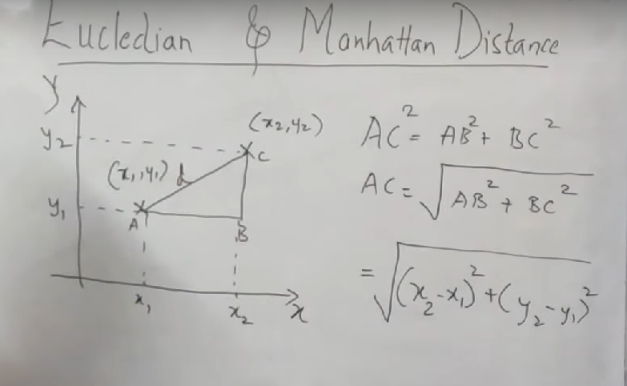
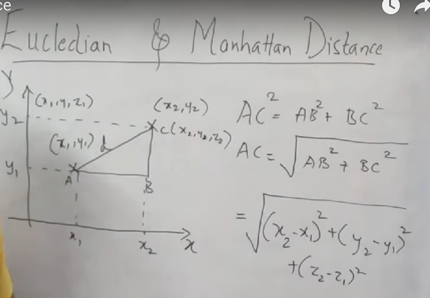
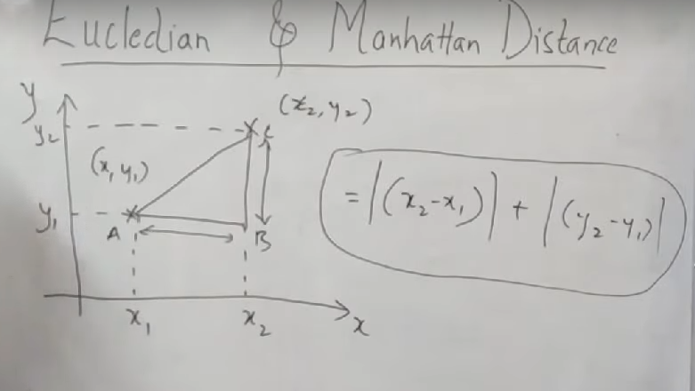
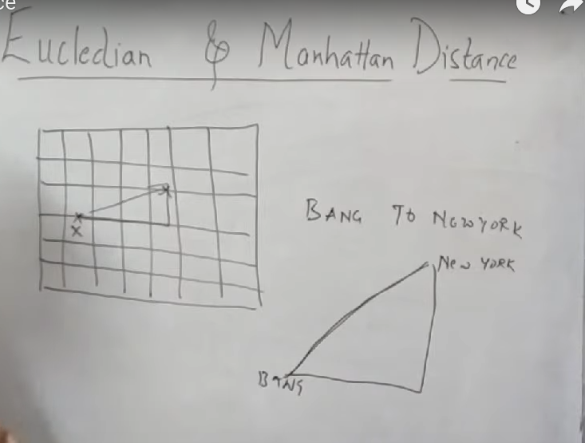

<br>

# `#01: HARVERSINE FORMULA:`

<br>

## [link1](https://www.youtube.com/watch?v=lSIVK82o2sI)

## [link2](https://www.youtube.com/watch?v=7g3eFs-9LVU)

<br>


### 1. What is the Haversine Formula?

The Haversine formula calculates the **great-circle distance** between two points on the surface of a sphere (e.g., the Earth) given their latitude and longitude. It accounts for the Earth's curvature and is widely used for distance calculations in navigation, geography, and mapping.

The haversine formula is a very accurate way of computing distances between two points on the surface of a sphere using the latitude and longitude of the two points.

The formula is given by:

$a = \sin^2(\frac{\phi B - \phi A}{2}) + \cos \phi A * \cos \phi B * \sin^2(\frac{\lambda B - \lambda A}{2})$ 

$c = 2 * \arctan2(\sqrt{a}, \sqrt{1-a})$ 

$d = R \cdot c$

From the above equation:

- $\phi$ is latitude
- $\lambda$ is longitude
- $R$ is the Earth's radius

<br>

### 2. Step by Step Instructions For Solving Problem:

1.  **Convert Degrees to Radians:** Convert the latitude ($\phi$) and longitude ($\lambda$) values from degrees to radians.
2.  **Plug in the Values:** Substitute the latitude ($\phi$) and longitude ($\lambda$) differences into the formula.
3.  **Perform the Calculations:**
    * Compute 'a' first.
    * Use 'a' to find 'c'.
    * Multiply 'c' by the Earth's radius 'R' to get 'd'.

<br>

### 3. Here are the primary uses of the Haversine formula:

* **Navigation**: It's fundamental for calculating distances for air, sea, and land navigation. It provides a more accurate route distance over long ranges than a simple straight-line calculation because it accounts for the Earth's curvature.
* **Geography and Mapping**: This formula is widely used in Geographic Information Systems (GIS) to accurately measure distances between locations on a map, such as determining the distance between cities or landmarks.
* **Data Science and Machine Learning**: In data-intensive fields, it's used for **feature engineering**. For example, in a ride-sharing or delivery service dataset, it can be used to calculate the direct distance between a pickup and drop-off point. This new distance feature is crucial for predicting travel time, cost, or driver efficiency.
* **Game Development**: It can be used in games that simulate real-world geography to calculate distances between in-game locations.

<br>

--- 

<br>

### 4. Example:

## Example Calculation: Haversine Formula

Based on the image, here is the step-by-step solution for calculating the distance between the two points.

The given points are:
* **Point A:** 5° 4' 11.85" N, 6° 57' 52.96" E
* **Point B:** 12° 39' 36.08" N, 8° 35' 56.40" E

**Step 1: Convert Degrees, Minutes, Seconds to Decimal Degrees**

To use the Haversine formula, the coordinates must be in decimal degrees.

* **Point A:**
    * Latitude: 5° + (4/60) + (11.85/3600) = **5.06995833° N**
    * Longitude: 6° + (57/60) + (52.96/3600) = **6.96471111° E**
* **Point B:**
    * Latitude: 12° + (39/60) + (36.08/3600) = **12.66002222° N**
    * Longitude: 8° + (35/60) + (56.40/3600) = **8.599° E**


**Step 2: Convert Decimal Degrees to Radians**

The Haversine formula requires the coordinates to be in radians. The conversion is done by multiplying the decimal degrees by $(\pi/180)$.

* **Point A:**
    * Latitude: 5.06995833° $\times$ $(\pi/180)$ = **0.08848746586 radians**
    * Longitude: 6.96471111° $\times$ $(\pi/180)$ = **0.12155799 radians**
* **Point B:**
    * Latitude: 12.66002222° $\times$ $(\pi/180)$ = **0.22095914 radians**
    * Longitude: 8.599° $\times$ $(\pi/180)$ = **0.15008083 radians**

**Step 3: Apply the Haversine Formula**

Now, plug these radian values into the Haversine formula, using the given Earth radius $R = 6,371$ km.

The Haversine formula is:
$a = \sin^2(\frac{\Delta\phi}{2}) + \cos\phi_1 \cdot \cos\phi_2 \cdot \sin^2(\frac{\Delta\lambda}{2})$<br>
$c = 2 \cdot \arctan2(\sqrt{a}, \sqrt{1-a})$<br>
$d = R \cdot c$<br>

Where:
* $\Delta\phi = \phi_2 - \phi_1 = 0.22095914 - 0.08848746586 = 0.13247167414$<br>
* $\Delta\lambda = \lambda_2 - \lambda_1 = 0.15008083 - 0.12155799 = 0.02852284$<br>

Calculate the 'a' value:
$a = \sin^2(\frac{0.132471674}{2}) + \cos(0.088487466) \cdot \cos(0.22095914) \cdot \sin^2(\frac{0.02852284}{2})$<br>
$a = \sin^2(0.066235837) + \cos(0.088487466) \cdot \cos(0.22095914) \cdot \sin^2(0.01426142)$<br>
$a \approx (0.066179)^2 + (0.9961) \cdot (0.9759) \cdot (0.014260)^2$<br>
$a \approx 0.0043796 + (0.9718) \cdot (0.0002033)$<br>
$a \approx 0.0043796 + 0.0001976$<br>
$a \approx 0.0045772$<br>

Calculate the 'c' value: `here "," means simply divide` <br>
$c = 2 \cdot \arctan2(\sqrt{0.0045772}, \sqrt{1-0.0045772})$<br>
$c = 2 \cdot \arctan2(0.067655, 0.99771$<br>
$c \approx 2 \cdot 0.067824$ `in calculator we got ans is degree, need to convert into radian.`<br>
$c \approx 0.135648$ radians<br>

Calculate the final distance 'd':
$d = R \cdot c = 6371 \text{ km} \cdot 0.135648$<br>
$d \approx 864.98 \text{ km}$<br>

The distance between the two points is approximately **865 km**.

```python 


def haversine_formula(lat1, lon1, lat2, lon2):
    # Convert degrees to radians
    lat1, lon1, lat2, lon2 = map(np.radians, [lat1, lon1, lat2, lon2])

    # Haversine formula
    dphi = lat2 - lat1
    dlambda = lon2 - lon1

    a = np.sin(dphi / 2.0)**2 + np.cos(lat1) * np.cos(lat2) * np.sin(dlambda / 2.0)**2
    c = 2 * np.arctan2(np.sqrt(a), np.sqrt(1 - a))
    
    # Earth radius in km
    R = 6371.0
    d = R * c
    return d

lat1 = 5.06995833
lon1 = 6.96471111
lat2 = 12.66002222
lon2 = 8.599 

distance_km = haversine_formula(lat1, lon1, lat2, lon2)
print(distance_km)
## ANS: 862.8356745551915 KM 
```

<br>

--- 

<br>
<br>

# `#02: Euclidean Distance FORMULA:`

<br>
<br>



`Euclidean distance is based on, pythagorean theorem.The formula is only for 2D.`



`If our dimention 3D then, the formula look like above. As the dimensionality of the data increases, Euclidean distance becomes less effective at distinguishing between points. This phenomenon is known as the curse of dimensionality.`


<br>

--- 

<br>
<br>

# `#03: Manhattan Distance FORMULA:`

<br>




`Almost similar, but we take |mod| in the case of Manhattan Distance. `


<br>

# `#04: Use Case of Euclidean Distance VS Manhattan Distance`

<br>



- **Manhattan Distance:**`In, develop country, the home are divided into grid. Like the above image if you want to go from place X to Y, then we can calculate Manhattan Distance.` 

- **Eucludian Distance:** `Flying from one distance from other in case of Drones or plane we use the Eucludian distance formula.`

