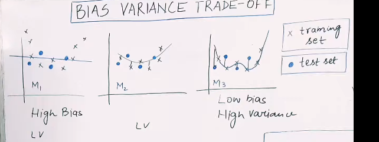
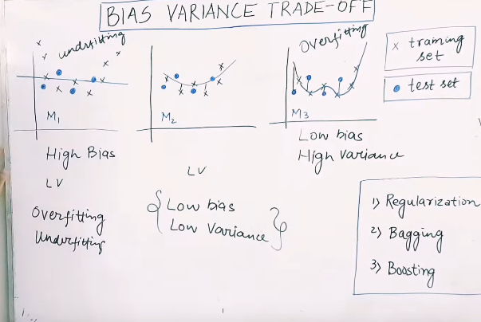

 

# `# Bias Variance Trade OFF:`

 

**BIAS:** The inability of a ml model to capture the relationship in the tranning data. `একটা ml model tranning data দিয়েই ভালো performance করে  না, তাহলে আমরা সেইটাকে BIAS বলতেছি ।`

এখানে নিচের ছবিতে, M1 মডেল high bias means tranning data ভালো করে capture করতে পারতেছে না । M2 model is low bias means tranning data তে ভালো করে fit হয়েছে । 

**Variance:** Difference of fit of various dataset। মানে হচ্ছে যে, tranning এর উপর  error এসেছে 10% আর  testing এর উপর error 90% । এইটা আমরা high variance বলতেছি । যদি, 10% 15% হতো তখন সেইটা আমরা বলতাম low variance । উপরের, ছবির ক্ষেত্রে bias and variance দুইটায় বলে হয়েছে । 

 

**Overfiting:** কোন ml model tranning dataset এ ভালো perform করে কিন্তু testing dataset এ খারাপ performance করে । 

**Underfiting:** কোন  ml model tranning dataset এই ভালো  performance করেতেছে না । 

### **আমরা এমন model choose করবো, যা low bias and low variance.**
M1 model কে নিবো না কারণ এর Bias high, অন্যদিকে, M3 model কে বাদ দিবো যেটাকে আমরা কারণ, high variance এর কারণে । 

কিন্তু, model m2 তে Low bias and low variance এই relation কে আমরা বলি bais variance trade-off. 

