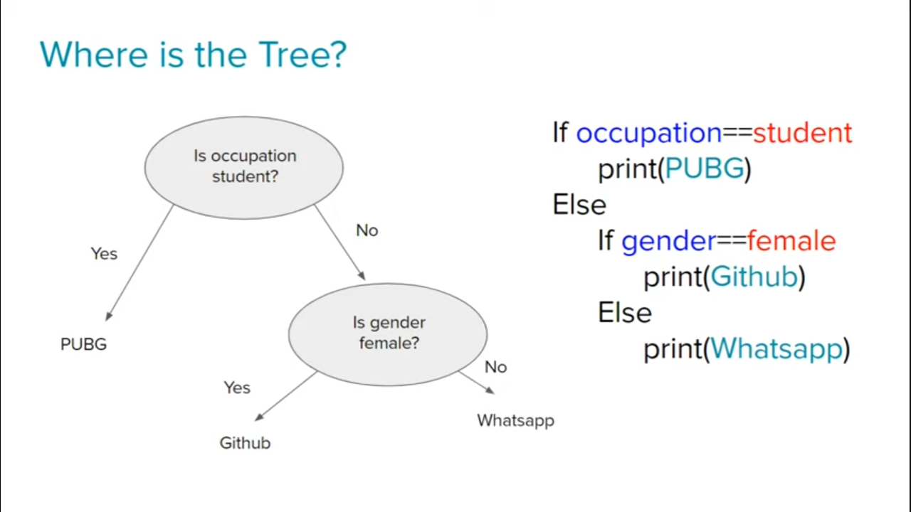
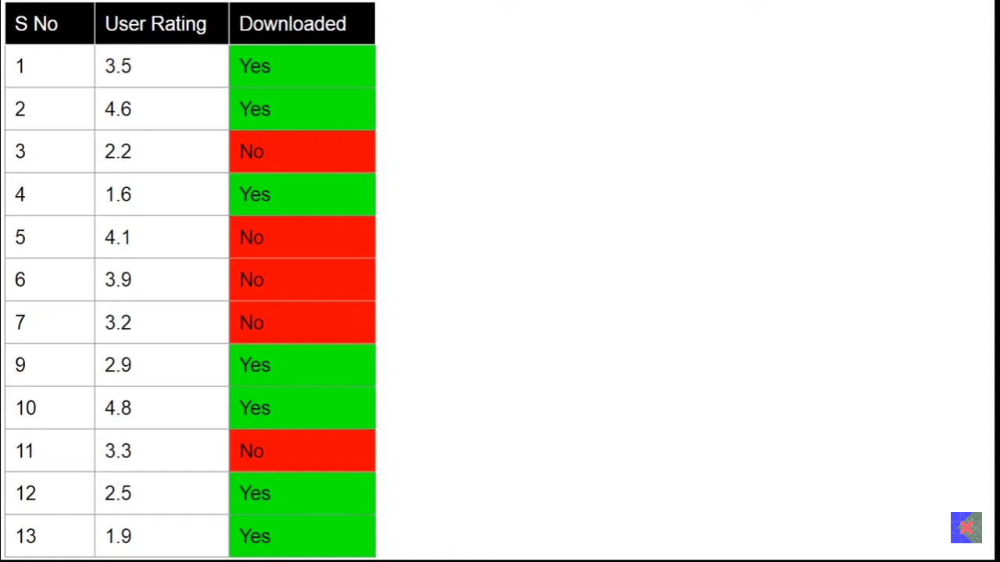

 
 

# `# Intorduction to decision tree:`

 
 

চলো, example এর সাহায্যে আমরা decision tree কি সেইটা বুঝি । নিচের ছবিতে আমাদের যদি Genede, Occupation দেখে, apps Suggestion করতে পারবো কি না ? আমরা খুব সহজেই nested if-else ব্যবহার করে app suggestion দিতে পারবো  । Decition Trees is nothing but nested if-else condition. 

যদি Desition Tree nested if-else হয়, তাহলে, এর Tree কীভাবে from করবো?  

Let's take another example. Weather condition এর basis এ একজন player ওইদিন tenis খেলেছিলো নাকি খেলেনাই । এই information দেওয়া আছে । তাহলে আমাদের decision tree হতে পারে । 

যদি, Input query [Rainy,Mild(Temperature),High,Strog] এর ভিত্তিতে আমরা যদি query করি তাহলে আমরা, Rainy->High-> Play=No খুব সহজেই যেতে পারতেছি  । আর বাকী গুলো ignore করতে পারতেছি , model complixity log2n . 

এখন আমরা যদি Neumerical Data এর কথা চিন্তা করি তাহলে  কি nested if-else condition দিয়ে decision boundary বের করতে পারবো ? 

PL-> Petal Length  
SP -> Sepal Length

 

### **Geometric Intuition:** 
যদি y-axis এ আমরা  Sepal Length এর  x-axis Petal Length নেই তাহলে নিচের মতো desition boundary বানাতে পারবো । শুরুতে, PL<2.0 এর জন্য  Setosa যেহেতু, already divide হয়ে গেছে তাই, 2.0 থেকে virginica আর vericolor eর ecision bondary বানিয়েছি ।  

### **Pseudo Code:** 

Decision trees নিচের ৪ টা step এ কাজ করে  :
- Dataset 
- Best Features
- Split data based on best features
- **Recursivly do (1,2 and 3)**

### In conclusion:
আমরা যদি উপরের decision tree এর geometric Intution কে আমরা যদি 5d,6d আকারে কল্পনা করি তাহলে,  decision boundary(hyper plane হবে) hyper cuboids হবে । 

### Terminology:
- শুরুটা Root Node , শেষের টা Leaf Node, মাঝখানের গুলোকে Decision node বলি । 

### Some question: 
- কোন column সবচেয়ে ভালো হবে । 
- এর পরের সবচেয়ে কোন column ভালো হবে data split  করার জন্য  
- - Numerical data এর জন্য splitting criteria কেমন হবে ?  

### Advantage and Disadvantages:
- Prone to errors for imbalanced datasets. (imbalanced datasets এর কারণে সমস্যা হয় । )

### CART - Classification and Regression Trees:

- mainly আমরা decision tree classification problem এর উপর  apply করবো । কিন্তু, একে মাঝে মাঝে, regression problem এর উপর apply করা হয় এর জন্য একে CART বলা হয় । 

 
 

# How Decision Trees Works:? 

Decision Trees কীভাবে কাজ করে এইটা শিখার জন্য আমাদের Entropy and  Information Gain শিখতে হবে । 

## `# Decision Trees Entorphy:`

 
 

 
 

 
 

## `# Information Gain:`

 
 

 
 

## `# Gini Impurity:`

 
 

Sklearn.tree.DecisionTreeClassifier এ আমরা criterion এ গেলে দেখতে পাবো যে,  এর ভ্যালু gini,entropy হতে পারে । আর default ভ্যালু হচ্ছে gini এখন তো আমরা entropy কি সেইটা দেখেছি ।  তো gini কি সেইটা দেখতে হবে । 

Purity measure  করার একটা পদ্ধতি  just like Entropy শুধু formula  আলাদা । 

Gini Impurity calculate করার পর এর Information gain calculate করার জন্য আগের formula ব্যবহার করা হয় । কিন্তু, আমরা কেন তাহলে, gini impurity ব্যবহার করি ? Probability(Yes) = 0.5 and probility(NO) = 0.5 হলে, entrophy = 1, Gini = 0.5 আসে । আর, entorphy calculation এর সময় log এর gini তে square করা লাগে তো gini computationally inexpensive, entrophy এর থেকে  । কিন্তু, কিছু কিছু জায়গায় আবার, entophy ভালো result দেয় gini এর চেয়ে তো  দুইটায় hyperpaprameter । তো দুইটা দিয়েই আমাদের model evaluation করে দেখতে হবে । 

 
 

## `# Example Handling Neumerial Data: `

 
 

