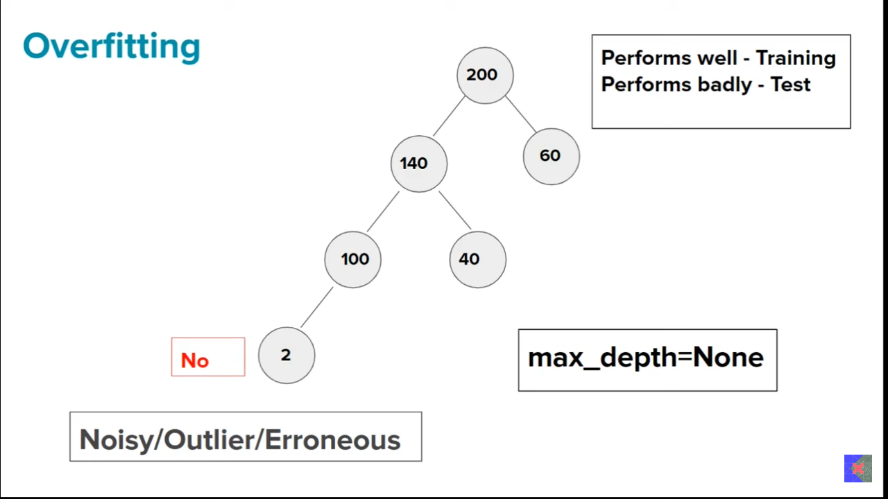
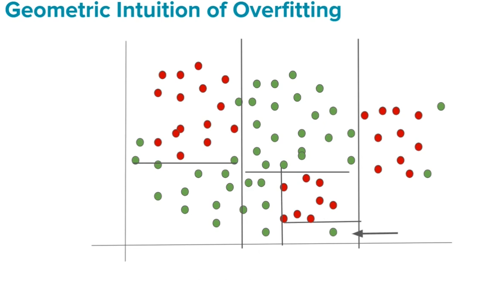
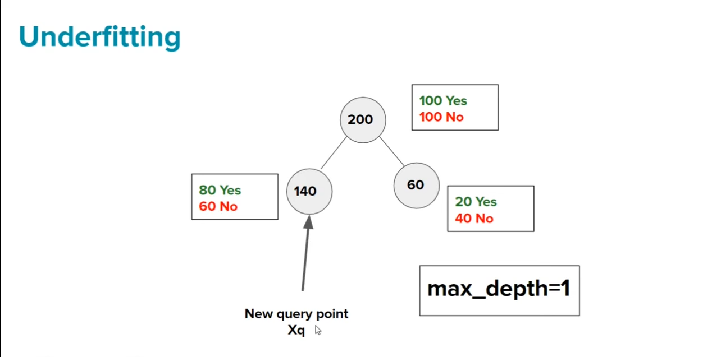
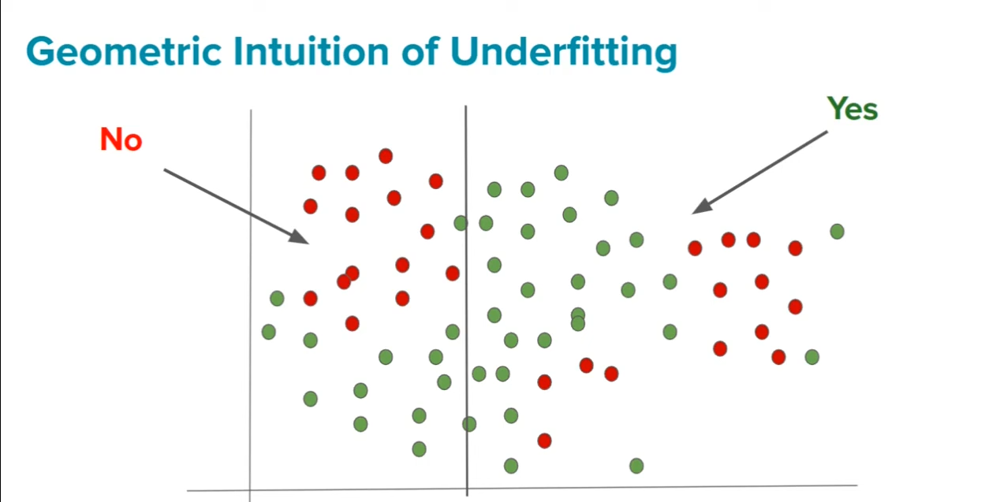

Decision tree তে overfiting অনেক বেশি হয় । nested else-if condition এর কারণে । তো, এই overfiting কে reduce করার জন্য কিছু hyperparamters আছে । আজকে এই গুলো নিয়েই পড়াশোনা করবো ।  

## `# Depth Of the Tree:`

**Overfiting->** আমার ml model tranning এর উপর ভালো  result  দিচ্ছে কিন্তু,  testing উপর ভালো result দিচ্ছে না তাহলে মডেল আমার overfiting  করেছে । 

আমরা entropy and information gain দিয়ে data কে split করেছিলাম। এখন, leaf node এ তো entropy=0 আচ্ছা । সবকিছু ঠিকঠাক আছে । এখন যদি এমন হয় যে, আমাদের leaf node টায় outliers তাহলে আমার কি করবো ?  max_depth = None . নামে একটা parameter আছে । এইটার ভ্যালু কমিয়ে বাড়িয়ে আমাদের hyperparameter tunning করতে হবে  ।

## `# Geometric Intuition of Overfitting:`

আমরা এত nested if-else condition দিয়েছি যে, ছবিতে দেখানো, point এর আশে পাশে যারা আছে তারা সবাই Red। তাই একে আমরা outilers হিসেবে image করতে পারি । 

 

# `# Underfitting:`

max_depth=1, করার ফলে আমাদের tree অনেক ছোট form হয়েছে । যার ফলে,  underfitting হয়ে গেছে । 

আমাদের max_depth=1 এর ভ্যালু এমন ভাবে set করতে হবে যেন,  overfiting and underfitting কোনটায় না হয় । 

 
 

# `# Hyperparameter:`

- Criterion: "gini","entrophy"

- Splitter: 

- Max Depth: int 

- Min Samples Split: int `Minimum এত গুলো row থাকলে split করবে ।  যদি কোন জায়গায় int এর value থেকে কম থাকে তাহলে সেইটায় leaf node হয়ে যাবে ।  এই int value এর মান যত বাড়বে তত underfitting, আর যত কম থাকবে তত overfitting হওয়ার possibility থাকে । `

- Min Samples Leaf: `(Similar to min samples split)`

- Max Features: `(কত গুলো column দিবো সেইটা fix করে দিতে পারি । বেশি overfitting হলে max features দিয়ে total column কম নিবো । আর, column গুলো randomly selected হবে । )`

- Max Leaf Nodes: `(Max Total কত গুলো Leaf node হবে তার সংখ্যা)`

- Max Impurity Decrease: int(0~1)`(Information Gain এর difference int চেয়ে বেশি হলে আর split করবে না )`

