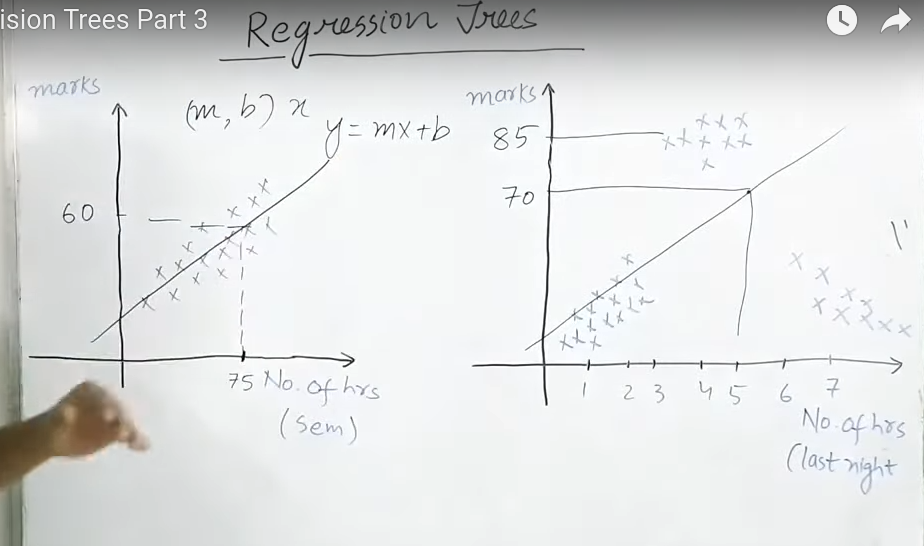
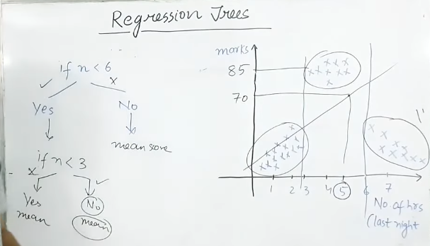
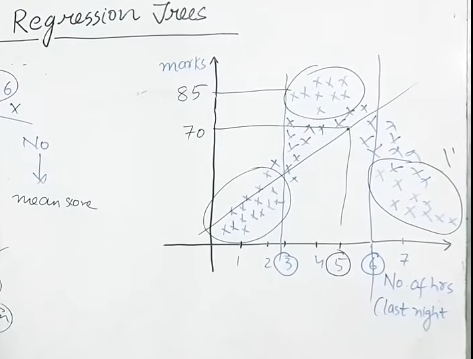
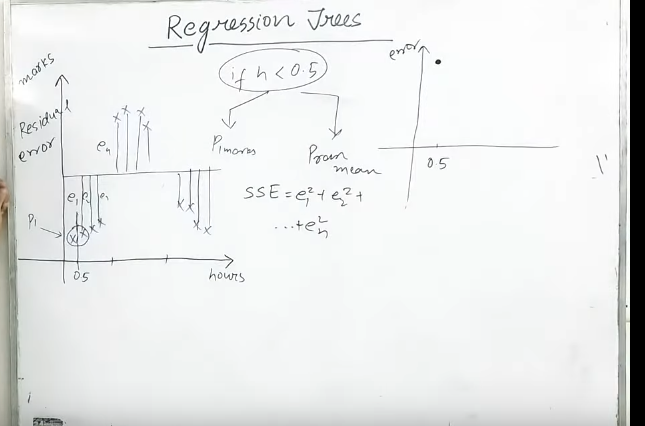
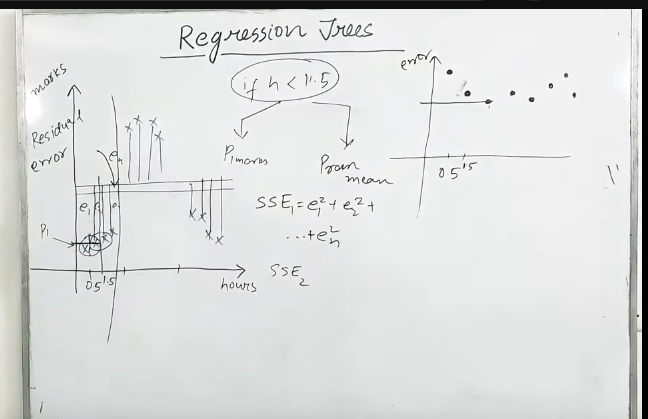
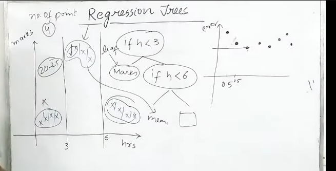
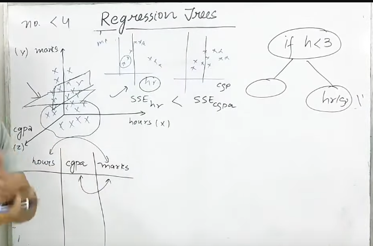

 
 

# `# Regression Tree:`

 
 

এতক্ষন আমরা classification problem এ decisition tree কীভাবে apply করতে হয় সেইটা শিখলাম । এখন, আমরা regression problem এ কীভাবে solve করবো সেইটা শিখবো । 

প্রথম, গ্রাফটা তে, normal regression প্রবলেম যেখানে, linear relationship রয়েছে আমরা সেখানে best fit line বের করেছি । যেখানে, পুরো semister এ আমাদের  পরীক্ষার্থীরা কত পড়াশোনা  করেছে । তার উপর ভিত্তি করে আমাদের  গ্রাফ টি বানানো হয়েছে । 

২য় গ্রাফে আমরা পরিক্ষার last 24 hours এর উপর ভিত্তি করে যারা পড়াশোনা করেছে । তাদের marks কেমন ছিলো তা দেখিয়েছি । 2nd graph, এখানে, আমরা traditional regression প্রবলেম ব্যবহার করতে পারতেচ্ছি না । কিন্তু, মজার ব্যপার হচ্ছে এইটাও একটা regression Problem । এই ধরনের প্রবলেমের জন্য আমরা Regression Tree ব্যবহার করবো । 

আমরা condition এর উপর ভিত্তি করে split করতে পারতেছি । এখন যদি data গুলো  continous হয় তাহলে আমরা কীভাবে solve করবো? spliting crteria কিভাবে বুঝবো । 

# `# How to find those spliting theshold value:`

আমরা প্রথমে, hours এর একটা ভ্যালু ধরে নিবো । তারপর সেইটা থেকে, tree বানাবো , তারপর, সব গুলো, point থেকে একটা mean value বের করবো । তারপর সেইটা থেকে আমরা Residual Error বের করবো । তারপর  error vs hours নিয়ে একটা গ্রাফ বানাবো । 

এখন, আমরা  এইভাবে অনেগুলো hours point নিয়ে একটা error vs hours গ্রাফ পাবো । তারপর সেইটা থেকে যার error সবচেয়ে কম হবে সেইটা হবে আমাদের প্রথম সেট । তারপর পরেরটা সিলেক্ট করবো । 

এখন যদি আমরা সব পয়েন্ট এর জন্য উপরের  process টা ফলো করি তাহলে আমরা ভালো result পাবো, কিন্তু শুধু tranning data তে, testing data তে না । তার আমরা একটা minimum number of point সেট করি । আমাদের Example এর জন্য  ৪ টা সেট করলাম । 

# `# If we have 3D Data then?`

 
 

# `# Hyperparameter: (almost same with decision trees)`

- Criterion: "mse", "mae", "friedman_mse"

- Splitter: "best", "random"

- Max Depth: int 

- Min Samples Split: int `Minimum এত গুলো row থাকলে split করবে ।  যদি কোন জায়গায় int এর value থেকে কম থাকে তাহলে সেইটায় leaf node হয়ে যাবে ।  এই int value এর মান যত বাড়বে তত underfitting, আর যত কম থাকবে তত overfitting হওয়ার possibility থাকে । `

- Min Samples Leaf: `(Similar to min samples split)`

- Max Features: `(কত গুলো column দিবো সেইটা fix করে দিতে পারি । বেশি overfitting হলে max features দিয়ে total column কম নিবো । আর, column গুলো randomly selected হবে । )`

- Max Leaf Nodes: `(Max Total কত গুলো Leaf node হবে তার সংখ্যা)`

- Max Impurity Decrease: int(0~1)`(Information Gain এর difference int চেয়ে বেশি হলে আর split করবে না )`

