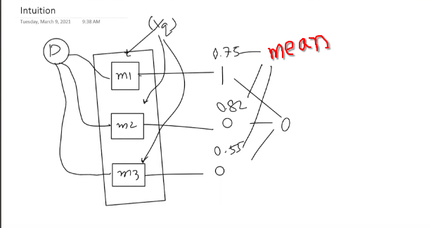
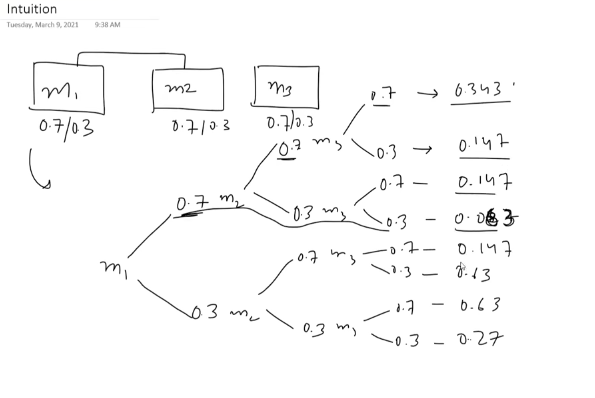

 

# `# Introduction and Core Idea of Voting:`

 

আমাদের কাছে একটা dataset(D) থাকে তারপর সেই dataset(D) দিয়ে নিচের ছবিতে ৩টা মডেল train করতেছি m1,m2,m3 যদি, regression problem হয় তাহলে, সব গুলোর mean বের করবো । তার যদি classification প্রবলেম হয় তাহলে 1,0,0 । যেহেতু, ০ বেশি তাই ans: 0 ।  

### `# Why voting works:`

মানে এমন ধরতে পারি যে, আমাদের m1 এর accuracy-> 56, m2-> 54, m3-> 60 হলে আমরা voting এর accuracy সবচেয়ে বেশি কীভাবে হয় ? এইটা কেন হয় সেইটা জানার আগে আমরা 2টা fact জেনে নেই ।

- model(m1,m2,m3) independent হতে হবে । 
-  আলাদা আলাদা ভাবে সব model গুলোর accuracy 50% এর উপরে হতে হবে না হলে voiting model এর output 50% এর থেকেও কম হবে ।

**Question:** আরেকটা উদাহারণ দিয়ে একটু বুঝা যাক । আমরা একটা জায়গায় যাচ্ছি knowledge gain করতে এখন, সেই জায়গায় যদি one background এর অনেক মানুষ থাকে তাহলে আমরা বেশি knowledge grather করতে পারবো নাকি যদি বিভিন্ন background এর অনেক মানুষ থাকে তাহলে  আমরা বেশি knowledge grather করতে পারবো ? 

**Ans:** অবশ্যই আলাদা আলাদা background এর বিভিন্ন লোক থাকলে আমরা knowledge বেশি grather করতে পারবো । voting এর ক্ষেত্রেও মোটামুটি সেম কাজ হয় । 

ধরি, আমাদের কাছে ৩টা model আছে, m1,m2,m3 যাদের আলাদা আলাদা ভাবে accuracy 0.7 । এখন, যদি আমরা একটা query point এই model কে দেই তাহলে আমদের সঠিক ans আসার posibility 0.7% আর ভুলো ans আসার posibility হলো 0.3% । এখন, আমরা, তিনটা model এর জন্য যদি probability graph আকি, তাহলে সেইটা অনেকটা নিচের মতো দেখাবে । আর, voting অনুযায়ী, দুইটা yes(0.7) আর একটা no(0.3) এমন combination গুলোর probabilty যোগ করে (0.343+0.147+0.147+0.147)*100 = 78% accuracy gain হবে । 

এখন, উপরের ব্যাখ্যা থেকে আমরা সহজেই বলতে পারবো যদি accuracy গুলো, 50% কম হয় তাহলে আমাদের voting এর accuracy খারাপের চেয়েও খারাপ হবে । কারণ, আগের বার আমরা 0.7 বেশি নিয়েছিলাম কারণ, আমাদের model গুলোর ans 70% এইবার 30% তাই আমাদের 30% এর ans গুলো নিতে হবে । 

 

