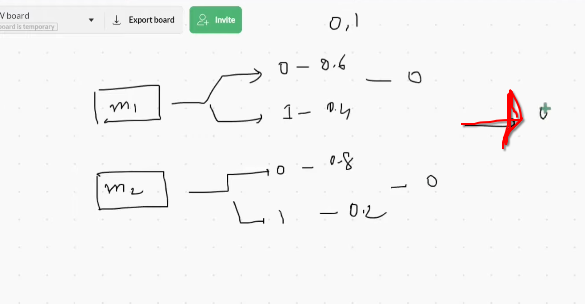
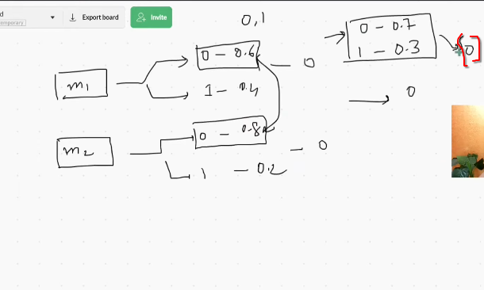

 

# `# Soft Voting, hard Voting and Code Example (Classification): 

 

hard voting এ আমরা m1 মডেলের o->0.6 and m2 মডেলের  0->0.8 তাই, overall আমার output 0 এসেছে । 

অন্যদিকে soft voting এ আমরা সব model এর accuracy গুলো  average করে output বের করি । 

**Soft Voting VS Hard Voting: কোনটা result ভালো দেয় ?** 
আসলে, দুইটায় result ভালো দিতে পারে। আবার, দুইটায় খারাপ দিতে পারে । অনেক ক্ষেত্রে soft voting ভালো result দেয় । আবার অনেক ক্ষেত্রে, hard voting ভালো result দেয় ।  

# `Code Example:` 

