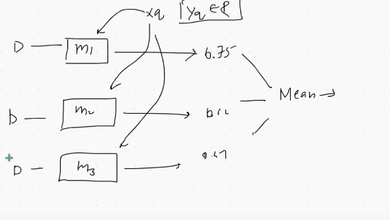

 

# `# Voting Regression Problem:`

 

আমরা মডেল গুলোর output গুলোকে mean করে যেইটা পাবো সেইটা হবে আমাদের regression problem এর output । 

### `# Web app for visulization`

 

### `# Code implementation.`

 

