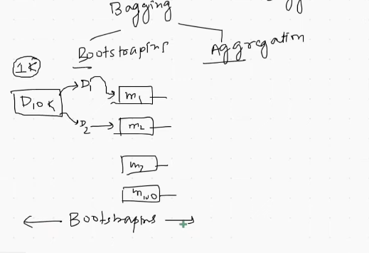

 

# `# Bagging: Core Idea`

 

Bagging -> (Bootstraping + Aggregation)  
Bagging এ আমাদের base model থাকে একটা । আর, আমরা আমাদের dataset কে 
split করে model train করি । Dataset যে split করলাম এইটাকে আমরা বলতেছি Bootstraping । 

Majority count এই step করে আমরা finally যে, output বের করতেছি একে বলতেছি aggregation । 

আমরা একটা, ml এ low-bias and low variance চাই । যেইটা, পাওয়া একটু কষ্টকর, noraml apporach এ maximum time হয়তো low-bias or high variance, high-bias and low variance এই সমস্যা দেখা দেয় । আর আমাদের, bagging (low-bias and high-variance) model পেতে সাহায্য করে । 

 

# `# Why bagging give Low-bias and Low-Variance Model?` 

 

- Bagging এ আমরা Low_Bias and High_Variance model ব্যবহার করি । 
- যেহেতু, আমাদের model Low_Bias আর আমরা data গুলোকে split করে মডেল কে দেই । সেহেতু,  আগে যেখানে, সব data গুলো একসাথে পাওয়ার কারণে high-variance আসতো এখন আর আসবে না, data গুলোকে  split করার কারণে ।

 

### `Code Example:`

 

**Type of Bagging:**
- Row sampling  (**with replacement**)
- Pasting (**no replacement**) 
- Random Subspace (**Column sampling**)
- Radom Patches (**We do both row and column Sampling**)

