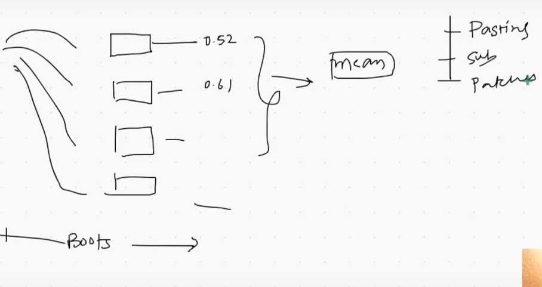

 
 

# `# Bagging Regression:`

 
 

Bootstapping part হুবহুব সেম থাকবে। আর, Aggregation part এ change আসবে । যেহুতু, regression problem সব গুলো model এর output কে mean করে final output বের করবো । আর, যেহেতু, Bootstapping part টুকু change হবে না তাই এখানে, Pasting, 
- Row sampling  (**with replacement**)
- Pasting (**no replacement**) 
- Random Subspace (**Column sampling**)
- Radom Patches (**We do both row and column Sampling**)
সব গুলোয় ব্যবহার করে, low-bias high-variance model কে low-bias, low-variance এ  convert করতে পারবো  ।  

