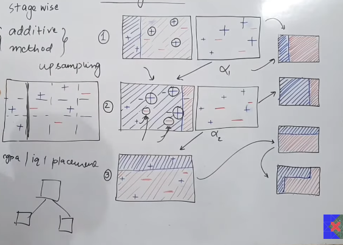

 

# Topics: 

- Introduction to Adaboost: (Lecture: 98)
- Adaboost With Mathematics: (Lecture: 99)
- Code Demo of Adaboost(Lecture: 100)
- Hyper parameter and GridSearchCV of Adaboost (Lecture: 101)

 
 

# `# Introduction to Adaboost: (Lecture: 98)`

 

## **Types of boosting algorithrm recap:**
- Ada Boosting
- Gradient Boosting
- XG Boosting

## **Introduction:**

`Adaboost প্রায় আরো, ২০-২৫ সালে আগে এসেছে । যখন, এসেছে তখন এইটা facedetection কাজে ব্যবহার করা হতো । এখন, তো আমরা deep learning related model ব্যবহার করি । Adaboost দিয়ে result ভালো আসে কিন্তু, random forest, gradient boosting, XGboost adaboost এর result এর থেকে ভালো perform করে ।  Adaboost না পড়তে আমরা Gradient boosting, XGboosting পারবো না  । `

## **Before Starting we need to know:**

- Weak Learns
- Decision Stumps
- +1 and -1 

**1. Weak Learns:** যেসব model এর accuracy কম । accuracy কম বলতে around 50% এর থেকে বেশি accuracy থাকবে  । তাদেরকে আমরা weak learns বলতেছি । এর opposite হলো strong learns হয় । সেগুলোর accuracy more than 80% হয় according to problem statement । Adaboost এ আমরা multiple weaklearn কে combine করে আমরা একটা strong learners বানায় । এর জন্য weaklearns সম্পকে জানলাম । 

**2.Decision Stumps:** হলো একধরনের weak learns যেখানে, Decision Tree Algorithm ব্যবহার করা হয় আর, যেখানে maximum depth=1 হয় । Example: 

ছবিতে, iQ বরাবর decision Stumps বের করেছি । decision sumps এ maximum dept=1 হবে ।  Decision Tree এ আমরা multiple split করি । decision stumps এ আমরা একটা split করবো । iQ বরাবর decision Stumps বের করে ৩ বার । 

একইভাবে আমরা, cgpa বরাবর বের করতে পারি । 

`তাহলে আমরা কোন split কে নিব ??? যেখানে আমাদের entropy or gini সবচেয়ে কম হবে ।`

**আমরা weak learns হিসেবে যেকোন algorithm even neural network ও ব্যবহার করতে পারি । কিন্তু, আমরা এখানে, decisition stumbs অর্থাঠ, decision trees with dept=1 ব্যবহার করে শিখবো ।**

**3. +1 and -1 :** এখানে, আমরা  0 and 1 label বলে কিছু ধরি না ।  Positive label কে 1 আর negative lavel কে  0 এর পরিবর্তে  1 ধরে নেই । 

 
 

## **Intution:**

 

- Adaboost কে Stage wise {additive method} বলে ।  কারণ, এখানে আমরা multiple weak-learners কে add করি । 

উপরের ছবিতে আমাদের, cgpa,iq,placement নিয়ে একটা dataset আছে । এখানে, আমাদের decision stumps করতে হবে ।  1 mark করা part এ,  decision stumps করার পর mark করা + গুলোর আসল জায়গা হচ্ছে, বাম পাশে কিন্তু এরা আসে ডান পাশে । 1st decision stumps complete করার পর যখন 2nd decision stumps করতে যাবো তখন, 1st decision stumps complete করার পর যেই point গুলো (mark করা +ve) misclassifed যেগুলোকে আলাদা একটা weightage বা focus বাড়ায়  দিবো । Focus বাড়ানোর এই techinque কে আমরা upsampling বলি ।  
 
1st decision stumps complete হওয়ার পর আরেকটা কাজ হয় , সেইটা হচ্ছে, 1st decision stumps করা model কে একটা weight assign (alpha_1) করা হয় । যখন, পুরো model টা তৈরি করা হয়ে যাবে তখন prediction করার সময় এই weight বলে দিবে  এই  decision stumps এর  ভ্যালু কতটুকু । `Bagging classifier এ আমরা সব গুলো base_estimator কে same weitage দেই, কিন্তু, এখানে, Boosting তা হয় না । ওই particular base_estimator কেমন আউটপুট দিচ্ছে সেইটার হিসাব করে তাকে একটা weight  assign করা হয় । `  

**আর একদম ডান পাশের ছবি গুলো Decision stumps শেষে আমাদের dicision boundary দেখতে কেমন সেইটা দেখাচ্ছে ।**  একইভাবে, আমরা 2nd, 3rd decision stumps complete করবো । 

এখন, আমরা alpha_1,alpha_2,alpha_3 পেয়ে গেছি ।  এখন, আমরা final output calculate  করবো নিচের formula দিয়ে, 

h(x) = sign(alpha_1*h1(x) + alpha_2*h2(x) + alpha_3*h3(x))

যেখানে, 
h1(x) হলো, 1st decision stumps । 
sign means, value +ve হলে class: +1 এর  negative হলে, -1 । 

 
 
 

# `# Adaboost With Mathematics: (Lecture: 99)`

 
 
 

চলো, একটা toy dataset নিয়ে কাজ করি । যেখানে, input feature হলো x1 and x2 and y হলো target feature ।  প্রথমে কাজ শুরু করার আগে আমরা আমাদের সব  row গুলোকে একটা weightage দিবো । formula, wt = 1/n here, n means number of rows । ছবিতে আমাদের, 5 টা row আছে তাই weight = 1/5 = 0.2 । সব গুলো row এর weight যোগ করলে ১ পাবো । 

**এরপর আমরা best decision stumps ঠিক করবো । এবং সেই model_1 এর সাপেক্ষে, y_pred বের করবো ।** এরপর model_1  এর  জন্য আমাদের alpha_1 বের করতে হবে । আর, alpha_1 depends করবে error_rate এর উপর । 

**চলো দেখি,  error rate কি? ** 
Below the picture, a,b and c নামে তিনটা মডেল আছে । যদি বলি সবচেয়ে ভালো model কোনটা তাহলে, ans হবে model a এরপর, হবে   model b, c না । কারণ, আমি যদি জানি, একটা লোক সবসময় মিথ্যা কথা বলে তো আমরা তার কথা কখনোই শুনবো না । আর যে লোকটা  একবার সত্য কথা বলে আরেকবার মিথ্যা কথা বলে বলে সেই ব্যক্তি আগের চেয়ে ভয়ংকর ।  এখানে,  model এর ক্ষেত্রেও সেম আমরা,  model b এর ans কে negative করে সঠিক ans পাবো । তাই আমরা model b ভালো বলবো c এর থেকে । 

এখন যদি আমরা alpha vs error rate এর একটা graph draw করি তাহলে আমরা এমন একটা fuction পাবো   যখন,  error rate কম থাকবে তখন alpha এর মান বেশি থাকবে আর যখন, error rate বেশি থাকবে তখন, alpha এর মান বেশি থাকবে কিন্তু, negative দিকে ।  Negative দিকে কেন?? আমরা শুনকে -1 দিয়ে representation করেছি তাই । আর, এই property আমাদের একটা function দেই যেইটা হচ্ছে,  1/2 ln(1-error)/error । 

ধরি আমাদের y_pred এ আমাদের model দুইটা ভুল করেছে । এখন, আমাদের m1 এর জন্য আমাদের error হবে, 

error = 0.2 + 0.2 `দুইটা ভুল করেছে`
এবং, 
alpha_1 এর ভ্যালু হবে, 
alpha_1 = 1/2 ln(1-0.4/0.4) = 0.2 

এখন, আমাদের upsampling করতে হবে । Upsampling এ আমরা যেই row দুইটার ans ভুল হয়েছে তাদের weight বাড়িয়ে দিব । আর, যাদের টা ঠিক আছে তাদের weight কমিয়ে দিব । In a way, আমরা missclassified point গুলোর weight kএ boost করেছি । তাই, নাম এসেছে boosting । এখন নিচের formula গুলো দিয়ে  আমরা weight বাড়িয়ে দিবো ।

এখন, উপরের ছবি থেকে আমরা বলতে পারি যে, correctly classified point এর weight কমে গেছে আর  missclassified point এর weight বেড়ে গেছে ।  

 

উপরে আমরা সবগুলোর row এর জন্য updated ভ্যালু বের করে, নতুন একটা column তৈরি করেছি । কিন্তু, এই  নতুন column এর problem হলো, সব গুলো Value কে যোগ করলে sum=1 হয় না । তাই আমরা updated column  কে normalized করবো, 0.96 দিয়ে ভাগ করে । এরপর যোগ করলে আমরা যোগফল ১ পাবো । 

এখন, upsampling শেষ করার জন্য, new_wt কে আমরা একটা range হিসেবে প্রকাশ করবো, 1st(0-0.166) then(0.166-(0.166+0.25=0.416)) এইভাবে সকল গুলো করবো । এরপর , যেহেতু আমাদের ৫টা row আছে তাই, randomly ৫টা নাম্বার select করবো । আর, range create সময়, missclassified point গুলোর row এর range বেশি থাকবে, তাই, randomly number create করলে, number গুলো, বেশি range এর মধ্যে থাকার possibility থাকবে ।  Randomly generated number এর উপর ভিত্তি করে আমরা 5টা column select করে নতুন একটা dataset বানিয়ে সেইটাকে model_2 এর কাছে পাঠাবো । 

উপরের মতো, কাজ গুলো আবার, model_2 এর জন্যও হবে তারপর model_3 এর জন্য, তাহলে, আমরা, alpha_1,alpha_2 and alpha_3 পেয়ে যাবো । 

এখন, আমরা alpha_1,alpha_2,alpha_3 পেয়ে গেছি ।  এখন, আমরা final output calculate  করবো নিচের formula দিয়ে,  
h(x) = sign(alpha_1*h1(x) + alpha_2*h2(x) + alpha_3*h3(x))  
যেখানে,  
h1(x) হলো, 1st decision stumps । 
sign means, value +ve হলে class: +1 এর  negative হলে, -1 । 

 
 
 

# `#  Code Demo of Adaboost(Lecture: 100)`

 
 
 

- Code demo of adaboost
- Simple explanation why we multipy with e^x or e^-x why?
- if our error=0 then, we can't devide with error, error+0.0000000000000001

 
 
 

# `#  Hyper parameter and GridSearchCV of Adaboost (Lecture: 101)`

 
 
 

### **All the hyper parameter of Adaboost**

- **base_estimator:** decision tree(max_depth=1),LOR,SVM but Not `KNN(there is no sample weight feature in knn)`. We get best result with decision tree as decision stumps.

- **n_estimators:** (Total_number of base_estimator, default=50, if we get better result before 50, then tranning will stop).

- **learning_rate:** lr<=1, default:1 ।
এই learning_rate, alpha এর সাথে গুলো হয়, যদি, lr=0.1, তাহলে এইটা alpha এর value 10 times কমালো  । এতে লাভ কি হলো??   
updated_weight = weight* e^alpha  
e^x or e^-x এর গ্রাফ থেকে,(desmos)   
আগে যেখানে ভ্যালু বেশি হচ্ছিলো, এখন সেইটা কম হবে ।  
Overall, আমরা তো, n_estimator এর value বাড়ালে আমাদের model এ overfitting দেখা দিবে । আমরা, overfitting যাতে কমাতে পারি এর জন্য আমরা, lr এর মান কমাতে পারি । 

 

- **algorithrm:** SAMME,SAMMER we can check with GridSearchCV which value is best.

`**n_estimator and learning_rate** এই দুইটা parameter ব্যবহার করলে আমরা adaboost এর best result বের করতে পারি ।`

 

### **Hyper parameter tunning with `GridSearchCV`**

 

